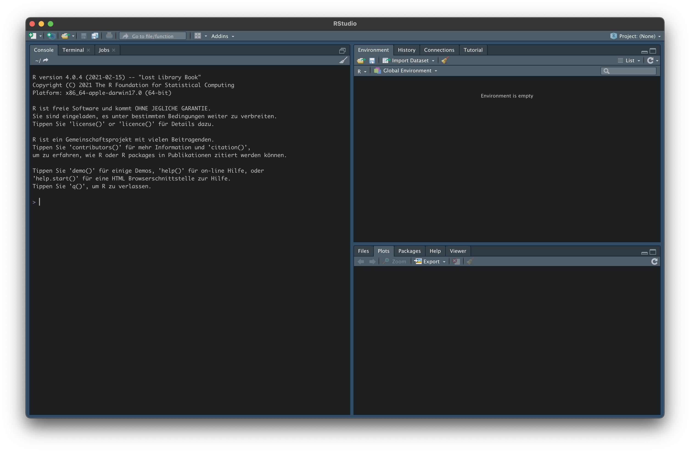
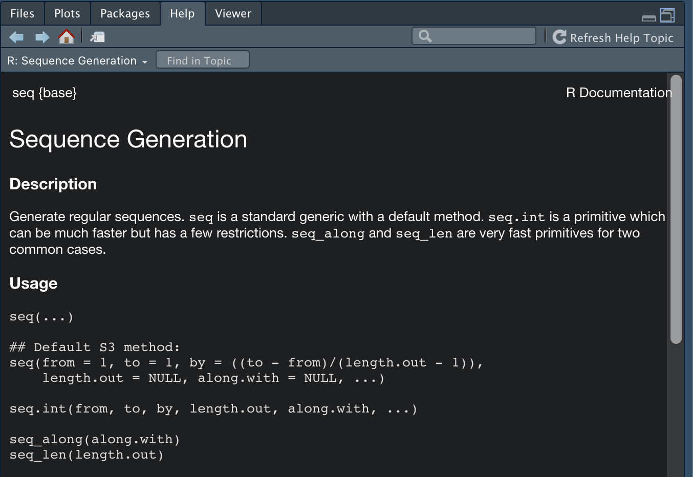
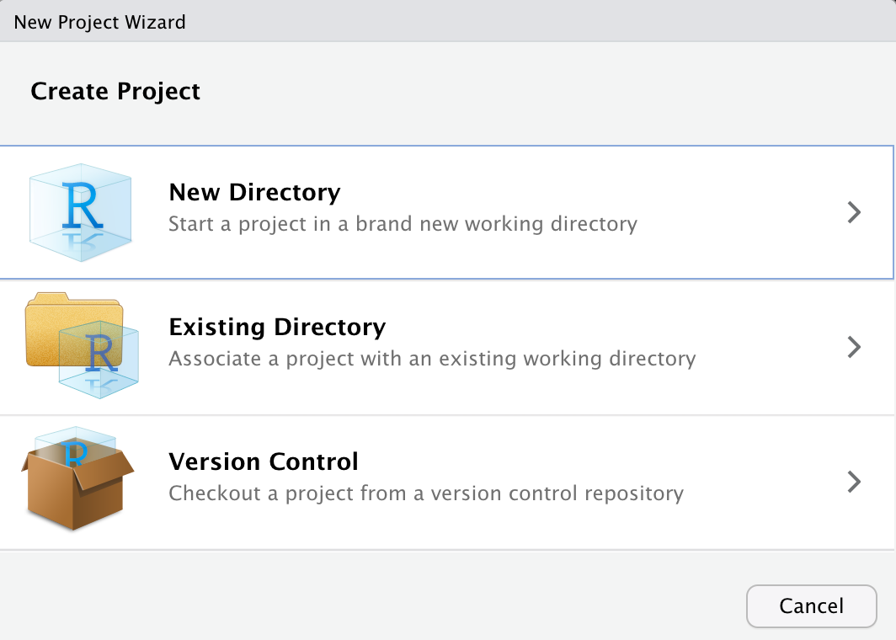

# RStudio 

In einem ersten Schritt wollen wir uns RStudio genauer ansehen. Öffnen Sie nun bitte RStudio. 

## Benutzeroberfläche

Sie sollten ungefähr die gleiche Benutzeroberfläche bzw. GUI (Graphical User Interface) vor sich sehen (standardmäßig weiß):

```{r, echo=F}

```

## Optionen

Wir empfehlen eindrücklich vor Beginn einer intensiven Nutzung mit RStudio die folgenden Punkte in den Optionen unter `Preferences`bzw. `Global Options` zu deaktivieren. 

1. Restore .RData into workspace at startup (deaktivieren)
2. Save workspace to .RData on exit (Never)

Folgend müssen wir immer alle Daten und Variablen bei einem Neustart von RStudio neu laden. Belohnt werden wir hingegen durch einen frischen Workspace.

```{r, echo=F, fig.align='center', out.width="75%"}
knitr::include_graphics("Bilder/Menu.png")
```

Sofern Sie Interesse an einer Änderungen der grafischen Darstellung von RStudio haben (z.B. eine dunkle Farbgebung), sollten Sie sich unter dem Menüpunkt `Appearance` ausprobieren.

## Die Konsole

Die R Konsole ist praktisch das Herzstück der Benutzeroberfläche und ermöglicht geschriebenen Code direkt oder über das `R Script` interpretieren zu lassen. Das `>` Zeichen ist die R Prompt (das Aufforderungszeichen). 

```{r, echo=F, fig.align='center', out.width="75%"}
knitr::include_graphics("Bilder/Konsole.png")
```

Die Konsole kann gerne auch als Übungsfeld für die ersten Eingaben genutzt werden, z.B. als Taschenrechner.

```{r}
2+3
```

## Das Environment und History

Im Reiter `Enironment` finden wir die Funktion `Global Environment` (drop-down menu). In diesem Bereich werden alle **Objekte**, also Variablen und Datensätze, die wir zuvor angelegt haben, gespeichert. Auch selbstgeschriebene Funktionen werden hier hinterlegt.

```{r, echo=F, fig.align='center', out.width="75%"}
knitr::include_graphics("Bilder/Environment.png")
```

Unter dem Reiter `History` finden Sie alle Befehle, die Sie bisher ausgeführt haben. Mit einem Doppelklick werden diese automatisch in die Konsole kopiert. Damit können sie einfach modifiziert und/oder erneut ausgebenen werden.

**Tipp:** Die History lässt sich auch direkt über die Testenbefehle `cmd`+ `up` auf macOS bzw. `strg`+ `up` bei Windows in der Konsole abrufen.

## Files 

Unter dem Reiter **Files** können Sie auf Ihre Datenstruktur zugreifen und damit ein **Arbeitsverzeichnis (working directory)** festlegen (siehe Bild). 

Die Festlegung eines Arbeitsverzeichnis erleichtert in Folge das Einlesen von weiteren Datenobjekten (z.B. Datensätzen), sofern nicht in einem `Project` gearbeitet wird.

```{r, echo=F, fig.align='center', out.width="75%"}
knitr::include_graphics("Bilder/Files.png")
```

## Packages (Packete)

R stellt uns über *base R* schon eine ganze Reihe nützlicher Funktionen zur Verfügung. Dieser bewegen sich jedoch auf sehr abstarktem Niveau und würden bei ausschließlicher Nutzung viele Analyseschritte sehr aufwendig machen. Folgend greifen wir auf die versprochenen Packete bzw. Ökosysteme zurück, um unsere Funktionsbibliothek deutlich zu erweitern. Packete lassen sich mit dem folgenden Befehl in der Konsole sehr leicht installieren. 

```{}
install.packages("tidyverse")
```

Damit haben wir alle Packete und Funktionen aus dem tidyverse installiert.

Nun wollen wir noch strengejacke und easystats installieren.

Die Packete aus strengejacke können entweder einzeln über das CRAN installiert werden, oder im Bündel über Github. Wollen wir z.B. nur das Packet sjmisc aus strengejacke installieren verwenden wir den folgenden Befehl:

```{}
install.packages("sjmisc")
```

Sofern das ganze Bündel installiert werden soll, laden wir zunächst das Packet remotes, um Github als Downloadplattform anwählen zu können und dann strengejacke.

```{}
install.packages("remotes")
remotes::install_github("strengejacke/strengejacke")
```

Damit wurde strengejacke erfolgreich installiert!

Das Ökosystem easystats ist gegenwärtig noch in der Testphase und damit auch nur über Github zu laden. 

```{}
install.packages("remotes")
remotes::install_github("easystats/easystats")
```

Gratulation, damit haben wir die wichtigsten Packete installiert!

Nun müssen wir sie nur noch aktivieren. Dafür nutzen wir den Befehl `library`, um auf unsere Funktionsbibliothek zuzugreifen.

```{}
library(tidyverse)
library(strengejacke)
library("easystats")
```

**Wichtig!** Das Packetbündel easystats muss beim Aufruf in Anführungszeichen geschrieben werden.

Als Alternative können wir Packete auch über den Reiter `Packages` installieren und aktivieren.

```{r, echo=F, fig.align='center', out.width="75%"}
knitr::include_graphics("Bilder/Packages.png")
```

**Updates** lassen sich über den Reiter `Packages` oder den folgenden Befehl machen:

```{}
update.packages()
```

bzw.

```{}
update.pachakes(ask = F)

```

## Help

Selbst wenn man täglich mit R arbeitet, ist es (fast) unmöglich, sich alle Funktionen zu merken. Deshalb bietet R über den Reiter `Help` die Möglichkeit eine lexikale Darstellung aller Funktionen und Anwendungsmöglichkeiten zu bekommen. Leider sind viele der Einträge zu Beginn nicht ganz leicht verständlich. Nach einiger Zeit bieten sie aber eine zuverlässige Möglichkeit neue Funktionen zu erlenen und alte nachzuschlagen. 

```{r, echo=F, fig.align='center', out.width="75%"}

```

Hat man eine Funktion im Kopf lässt sich diese leicht über das Suchfenster im `Help Viewer` suchen. Über die Konsole geht das natürlich auch. Der Befehl hier z.B. für den gewichteten Mittelwert:

```{}
?weighted_mean
```

Hier muss nur die gesuchte Funktion hinter ein `?` geschrieben werden.

Will man herausfinden, welche Funktionen in einem Packet enthalten sind, ist der Reiter `Packages` zu öffnen. Über das Suchfenster das entsprechende Packet suchen und mit einem Klick öffnen. Anschließend wird man im `Help Viewer` über die möglichen Funktionen in einer Auswahl informiert. 

Viele Entwickler erstellen zudem eigene Websites für ihre Packages. Hier einige Beispiele:

* Auf der Seite des [tidyverse](https://www.tidyverse.org/packages/) das gewünschte Packet aussuchen und dann über Reference eine Auswahlliste der Funktionen aufrufen. Beim Klick auf eine Funktion wird die dahinterliegende `Vignette` - Erklärung mit Beispielen - geöffnet.  
* Die Packete von strengejacke haben keine gebündelte Auswahl. Wir müssen uns also zuerst eines der Packete aussuchen (sjmisc, sjlabelled, sjplot, sjstats) und dann nach diesem suchen. Bei strengejacke lassen sich alle Packete über den folgenden Link öffnen: 
https://strengejacke.github.io/*Packetname*/, also z.B. https://strengejacke.github.io/sjmisc/
* Bei den Packeten von easystats gilt das genauso. Erst ein Packet wählen (parameters, performance, effectsize, correlation, see) und dann öffnen über: https://easystats.github.io/*Packetname*/

Um einen erster Eindruck über die Anwendungsmöglichkeiten und die Form der Packete zu bekommen, lohnt sich zudem der Klick auf den Reiter Articles auf den Dokumentationsseiten der Packete!

Abschließend ist noch die FAQ-Seite *Stackoverflow* zu empfehlen, auf der schier zu jedem Problem schon einmal eine Frage gestellt und diese beantwortet wurde. Hierzu lohnt es sich das eigene Problem mit dem zusätzlichen Schlagwort Stackoverflow in eine Suchmaschine zu geben und die Einträge nach Lösungen zu durchsuchen.

## Arbeiten mit RStudio

Auf an die praktische Arbeit mit R! 

### Projects (Projekte)

Vor der eigentlichen Arbeit mit R und der Analyse von Daten ist es immer ratsam über die Erstellung eines Projekts nachzudenken. Über den Menüpunkt `File` + `New Project` + `New Directory` + `New Project` öffnet sich die entsprechende Auswahlmaske. Hier kann ein Projektname und der gewünschte Speicherort festgelegt werden. 

```{r, echo=F, fig.align='center', out.width="75%"}

```

Im nächsten Schritt schieben wir die gewünschten Datensätze in den Projektordner, um einen ungehinderten Datenzugriff zu ermöglichen.

Vorteile:

* Alle *Files* werden beim Start des Projekts, über den blauen Projektwürfel (.Rproj), wieder geöffnet. 
* Es lassen sich beliebig viele Projekte gleichzeitig öffnen und zwischen diesen wechseln.
* Bei der Erstellung eines Projekts wird automatisch ein Arbeitsverzeichnis erstellt, auf das zurückgegriffen wird (Projektordner). Man muss sich also nicht mehr um das working directory bemühen und kann z.B. Daten- oder Skriptdateien direkt vom Projektordner aus aufrufen, ohne jedes Mal den vollständigen Pfad definieren zu müssen.

### Konsole oder RScript?

Es stehen dem Benutzer von RStudio wesentlich zwei Nutzungswege zur Verfügung:

**1. Befehle direkt über die Konsole eintippen**

Die Eingabe über die Konsole ist dann empfehlenswert, wenn man schnell etwas ausprobieren möchte, oder ein Befehl wiederholt werden soll. 

Die Konsole wird auch bei unvollständiger Eingabe von Funktionen relevant. Im folgenden Beispiel wurde eine Klammer am Ende der Funktion vergessen.

```{}
> seq(1, 100, 5
+
```

Nun muss entweder die fehlende Klammer zur Vervollständigung eingetippt, oder über `Esc`der Befehl abgebrochen werden. 

Wird ein Befehl ungewollt ausgeführt, oder ist R abgestürzt? Hier kann ganz leicht über `Session` + `Interrupt R` bzw. das rote Stoppschild über der Konsole der Befehl abgebrochen, oder die ganze Sitzung über `Session` + `Terminate R` neu gestartet werden.

**2. Befehle im Script speichern (vergleichbar mit Syntax aus SPSS)**

Zur Erstellung eines RScript öffnen wir über das Symbol mit dem weißen Blatt und grünem Kreuz (oben links) ein neues RScript (Tastenkürzel: `cmd bzw. strg` + `up` + `N`). Vorteile sind hier, wie auch in SPSS, die Möglichkeit zur übersichtlichen und nachvollziehbaren Arbeitsweise und das Speichern von Auswertungen. 

**Wichtig!** RScript-Datein werden beim Ausführen von oben nach unten gelesen. Wir können also Werte im Laufe eines Scripts immer wieder überschreiben und neu zuweisen. 

Wir probieren uns zu Beginn wieder an einer kurzen Rechnung aus.

```{r, results='hide'}
2+3
```

Um die entsprechende Zeile auszuführen, klicken wir auf `Run` (Tastenkürzel: `cmd bzw. strg` + `enter`). 

```{r, echo=F}
2+3
```

Der Output erscheint wie gewohnt in der Konsole. 

Im nächsten Schritt definieren wir das Ergebnis unserer mathematischen Operation als Variable (Objekt), um es für folgende Anwendungen nutzen zu können. 

```{r, echo=T}
x <- 2+3
```

Damit haben wir unsere gewünschte Variable (Objekt) mit der Bezichnung *x* definiert. 

Wichtig ist für uns erstmal, dass wir unsere definierten Variablen im `Environment` sehen können. x wird folgend mit dem Wert 5 angezeigt.

```{r, echo=F, fig.align='center', out.width="75%"}
knitr::include_graphics("Bilder/Environmentoutput.png")
```

### Tab completion

RStudio verfügt über eine weitere sehr hilfreiche Funktion: Tab completion. Während der Eingabe eines beliebigen Befehls erscheint über RStudio ein entsprechendes Menu mit Befehlsvorschlägen zur Vervollständigung. So erscheint z.B. bei der Eingabe von `weighted_mean()` eine ganze Reihe von Vorschlägen. Manuell wird auch über `Tab` das gleiche Menu aufgerufen. Wollen wir die erste Funktion übernehmen, drücken wir `Enter` zur Bestätigung. Zur Auswahl einer anderen Funktion einfach über die Pfeiltasten die richtige Funktion ansteuern und diese über `Enter` anwählen. 

```{r, echo=F, fig.align='center', out.width="75%"}
knitr::include_graphics("Bilder/tabcomp1.png")
```

Hat man eine Funktion eingegeben und drückt man innerhalb der Klammern `Tab`, erscheint eine Liste mit allen Argumenten dieser Funktion. Funktionsargumente definieren welche Daten einbezogen werden sollen und wie mit diesen umgegangen wird. `x =` steht z.B. für die eingehenden Daten und `weights =` für das anzuwendende Gewicht.

```{r, echo=F, fig.align='center', out.width="75%"}
knitr::include_graphics("Bilder/tabcomp2.png")
```

Überschneiden sich zwei Funktionensbezeichungen zwischen zwei Packeten oder wissen wir, dass eine Funktion in einem Packet enthalten ist, können wir auch über den Packetnamen gefolgt von :: eine Funktionsliste erzeugen.

```{r, echo=F, fig.align='center', out.width="75%"}
knitr::include_graphics("Bilder/tabcomp3.png")
```

### Nützliche Tastenbefehle (Shortcuts)

Folgende Tastenbefehle erleichtern das Arbeiten mit R:

Wir haben schon folgende Befehle kennen gelernt:

* `cmd bzw. strg` + `up` > Vorherige Befehle in der Konsole anzeigen
* `cmd bzw. strg` + `up` + `N` > Neues Script erstellen
* `cmd bzw. strg` + `Enter` > Eingabe ausführen

Weitere nützliche Befehle:

* `cmd bzw. strg` + `up` + `Enter` > Gesamtes Script ausführen
* `cmd bzw. strg` + `up` + `R` > Kapitel im RScript definieren
* `cmd bzw. strg` + `up` + `C` > Kommentar 
* `control bzw. strg` + `L` > Konsole leeren
* `cmd bzw. strg` + `up` + `A` > Code restrukturieren

Für folgende Kapitel:

* `option` + `-` > Zuweisungspfeil (->) erzeugen
* `cmd bzw. strg` + `up` + `M` > %<% erstellen


