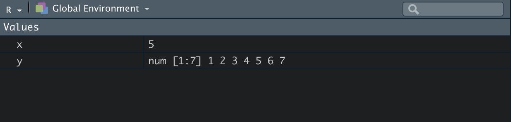

# RStudio

In einem ersten Schritt wollen wir uns RStudio genauer ansehen. Öffne dazu jetzt RStudio.

## Was du nach diesem Kapitel kannst {-}

- Die Benutzeroberfläche von RStudio sicher bedienen.
- Pakete installieren, aktivieren und aktuell halten.
- Den Unterschied zwischen Konsole und R-Script erklären.
- Projekte anlegen und ein sauberes Arbeitsverzeichnis nutzen.
- Hilfe-Seiten zu Funktionen und Paketen aufrufen.

## Benutzeroberfläche

Du solltest ungefähr diese Benutzeroberfläche (Graphical User Interface, kurz GUI) vor dir sehen (standardmäßig im hellen Theme):

```{r, echo=FALSE}
knitr::include_graphics("Bilder/GUI.png")
```

::: {.callout-note}
**Hintergrund: RStudio und Posit.** RStudio ist die *integrierte Entwicklungsumgebung* für R. Die IDE heißt weiterhin **RStudio**, die Firma dahinter wurde 2022 in **Posit** umbenannt. Wenn du im Web Verweise auf „RStudio Cloud" findest, sind sie heute unter [posit.cloud](https://posit.cloud/) zu finden.
:::

## Optionen

Wir empfehlen dir, vor der intensiveren Nutzung von RStudio die folgenden Punkte in den Optionen unter `Preferences` bzw. `Global Options` zu deaktivieren:

1. *Restore .RData into workspace at startup* — deaktivieren.
2. *Save workspace to .RData on exit* — auf *Never* stellen.

Damit musst du bei jedem Neustart von RStudio Daten und Variablen neu laden — der Vorteil ist ein wirklich frischer Workspace ohne unsichtbare Altlasten aus früheren Sitzungen. Das ist die Grundlage für *reproduzierbares Arbeiten*.

```{r, echo=FALSE, fig.align='center', out.width="75%"}
knitr::include_graphics("Bilder/Menu.png")
```

Wenn du an einer anderen grafischen Darstellung interessiert bist (zum Beispiel ein dunkles Farbschema), schau unter `Appearance` rein.

## Konsole

Die R-Konsole ist das Herzstück der Oberfläche und führt deinen Code direkt aus oder interpretiert ihn aus einem geöffneten R-Script. Das `>`-Zeichen ist die Eingabeaufforderung (*prompt*).

```{r, echo=FALSE, fig.align='center', out.width="75%"}
knitr::include_graphics("Bilder/Konsole.png")
```

Du kannst die Konsole gerne als Übungsfeld für deine ersten Eingaben nutzen — zum Beispiel als Taschenrechner:

```{r}
2 + 3
```

## Environment und History

Im Reiter `Environment` findest du das **Global Environment** (Dropdown). Hier werden alle Objekte (Variablen, Datensätze, Funktionen), die du angelegt hast, gespeichert.

```{r, echo=FALSE, fig.align='center', out.width="75%"}
knitr::include_graphics("Bilder/Environment.png")
```

Unter `History` siehst du alle Befehle, die du bisher ausgeführt hast. Per Doppelklick werden sie zurück in die Konsole kopiert und können dort modifiziert oder erneut ausgeführt werden.

::: {.callout-tip}
**Tipp.** Die History rufst du auch direkt über die Tastenkombination `cmd` (macOS) bzw. `strg` (Windows) + `↑` in der Konsole ab.
:::

## Files

Unter dem Reiter `Files` kannst du deine Datenstruktur einsehen und ein **Arbeitsverzeichnis (working directory)** festlegen.

Das Arbeitsverzeichnis erleichtert das Einlesen von Datensätzen erheblich — vorausgesetzt, du arbeitest nicht ohnehin in einem `Project` (das empfehlen wir, siehe unten). Setze das Arbeitsverzeichnis dorthin, wo dein Datensatz liegt.

```{r, echo=FALSE, fig.align='center', out.width="75%"}
knitr::include_graphics("Bilder/Files.png")
```

## Packages

R bringt von Haus aus — als *base R* — schon eine ganze Reihe nützlicher Funktionen mit. Für viele Analyseschritte sind sie aber zu abstrakt: Wir greifen deshalb auf zusätzliche **Pakete** zurück, die unsere Funktionsbibliothek erweitern.

In diesem Buch arbeiten wir bewusst mit nur zwei Ökosystemen:

- das **tidyverse** für Datenmanipulation und Visualisierung,
- **mariposa** für die statistische Analyse (entwickelt an der Universität Marburg).

### Installation

Das tidyverse ist auf CRAN, dem zentralen R-Paket-Archiv, verfügbar und lässt sich direkt installieren:

```{r, eval=FALSE}
install.packages("tidyverse")
```

Damit hast du in einem Schritt die Pakete `dplyr`, `tidyr`, `ggplot2`, `readr`, `purrr`, `tibble`, `stringr`, `forcats` und `lubridate` installiert.

mariposa wird derzeit über GitHub vertrieben. Du brauchst dafür einmalig das Paket `remotes`:

```{r, eval=FALSE}
install.packages("remotes")
remotes::install_github("YannickDiehl/mariposa")
```

Für die Grafik-Kombinationen in Kapitel 6 brauchst du außerdem noch `patchwork`:

```{r, eval=FALSE}
install.packages("patchwork")
```

### Aktivierung

Installierte Pakete musst du in jeder R-Sitzung mit `library()` aktivieren:

```{r, eval=FALSE}
library(tidyverse)
library(mariposa)
library(patchwork)
```

Alternativ kannst du Pakete auch über den Reiter `Packages` (rechts unten in RStudio) installieren und aktivieren — das ist gut für einen schnellen Überblick, aber für reproduzierbares Arbeiten ist der Code-Weg besser.

```{r, echo=FALSE, fig.align='center', out.width="75%"}
knitr::include_graphics("Bilder/Packages.png")
```

### Pakete aktuell halten

Updates lassen sich über den Reiter `Packages` oder per Code anstoßen:

```{r, eval=FALSE}
update.packages(ask = FALSE)
```

Das tidyverse aktualisiert sich am sichersten über eine erneute Installation:

```{r, eval=FALSE}
install.packages("tidyverse")
```

mariposa wird über `remotes` aktualisiert:

```{r, eval=FALSE}
remotes::install_github("YannickDiehl/mariposa")
```

::: {.callout-warning}
**Vorsicht.** Wenn du in der Mitte eines Projekts ein Paket aktualisierst, ändert sich potenziell das Verhalten deiner Funktionen. Pflege Pakete *zwischen* Projekten oder dokumentiere die genutzten Versionen mit `sessionInfo()`.
:::

## Help

Auch wer täglich mit R arbeitet, kann sich nicht alle Funktionen merken. R bietet dir deshalb über den Reiter `Help` eine vollständige Funktionsreferenz. Manche Einträge wirken am Anfang sperrig, sind nach einiger Übung aber die zuverlässigste Quelle.

```{r, echo=FALSE, fig.align='center', out.width="75%"}
knitr::include_graphics("Bilder/Help.png")
```

Wenn du eine Funktion im Kopf hast, geht es am schnellsten über die Konsole — ein Fragezeichen vor den Funktionsnamen reicht. Hier zum Beispiel für den gewichteten Mittelwert aus mariposa:

```{r, eval=FALSE}
?w_mean
```

Um alle Funktionen eines Pakets aufzulisten, öffnest du den Reiter `Packages`, suchst das Paket und klickst es an. Du landest in der Paketreferenz.

Viele Entwickler:innen pflegen zusätzlich eigene Webseiten für ihre Pakete — das sind oft die besten Einstiegspunkte:

- [tidyverse.org/packages](https://www.tidyverse.org/packages/) — Übersicht aller tidyverse-Pakete mit Vignetten und Funktionsreferenz.
- [yannickdiehl.github.io/mariposa](https://yannickdiehl.github.io/mariposa/) — Funktionsreferenz, Vignetten zu Labels, Gewichtung, deskriptiver Statistik, Korrelation, Regression, Skalenanalyse und SPSS-Kompatibilität.

::: {.callout-tip}
**Tipp.** Auf den Paket-Webseiten ist der Reiter *Articles* (oder *Vignettes*) Gold wert. Dort findest du längere Anwendungsbeispiele, die R-eigene Hilfe nicht abbilden kann.
:::

Wenn du im Web nach Hilfe suchst, ist [Stack Overflow](https://stackoverflow.com/questions/tagged/r) die zentrale Anlaufstelle. Ergänze deine Suchanfrage mit dem Schlagwort *Stack Overflow* — fast jedes typische R-Problem wurde dort schon einmal beantwortet.

## Arbeiten mit RStudio

Jetzt geht es an die praktische Arbeit mit RStudio.

### Projects

Bevor du mit Daten arbeitest, lohnt es sich, ein **Project** anzulegen. Über `File` → `New Project` → `New Directory` → `New Project` öffnest du die entsprechende Maske, vergibst einen Namen und einen Speicherort.

```{r, echo=FALSE, fig.align='center', out.width="75%"}
knitr::include_graphics("Bilder/Project.png")
```

Im nächsten Schritt schiebst du deine Datensätze in den Projektordner.

Was du davon hast:

- Alle geöffneten *Files* werden beim Start des Projekts (per Doppelklick auf die `.Rproj`-Datei) wieder geladen.
- Du kannst beliebig viele Projekte parallel öffnen und zwischen ihnen wechseln.
- Das Arbeitsverzeichnis ist automatisch der Projektordner — du musst dich nicht mehr darum kümmern, vollständige Pfade einzutippen.

### Konsole oder R-Script?

Du hast zwei Wege, R zu nutzen:

**1. Befehle direkt in die Konsole eingeben.**
Sinnvoll, wenn du schnell etwas ausprobieren willst oder einen Befehl nur einmal brauchst.

Bei unvollständiger Eingabe wartet die Konsole auf den Rest:

```
> seq(1, 100, 5
+
```

Hier fehlt die schließende Klammer. Entweder du ergänzt sie, oder du brichst mit `Esc` ab. Friert R einmal ein, hilft `Session` → `Interrupt R` (oder das rote Stoppschild über der Konsole). Im Notfall startest du die ganze Session über `Session` → `Terminate R` neu.

**2. Befehle in einem R-Script speichern (vergleichbar mit der Syntax-Datei in SPSS).**

Ein neues Script öffnest du über das Symbol mit dem weißen Blatt und grünem Kreuz (oben links) — oder per Tastenkürzel `cmd`/`strg` + `shift` + `N`. Der Vorteil: dokumentierte, reproduzierbare Arbeit.

::: {.callout-tip}
**SPSS → R.** Das R-Script ist das Pendant zur SPSS-Syntax-Datei. Du arbeitest weiterhin *in der Syntax* — nur in einer anderen Sprache. Die meisten SPSS-Workflows lassen sich Schritt für Schritt übertragen, oft sogar in weniger Zeilen.
:::

Wichtig: R-Scripts werden von oben nach unten gelesen. Du kannst Variablen also im Laufe des Scripts überschreiben oder neu zuweisen.

Ein erstes Beispiel:

```{r, results='hide'}
2 + 3
```

Mit `Run` (oder `cmd`/`strg` + `Enter`) führst du die aktuelle Zeile aus.

```{r, echo=FALSE}
2 + 3
```

Der Output erscheint in der Konsole. Im nächsten Schritt weisen wir das Ergebnis einer **Variable** (auch *Objekt* genannt) zu, damit wir es weiterverwenden können:

```{r}
var1 <- 2 + 3
```

`var1` ist jetzt im `Environment` sichtbar — mit dem Wert `5`.

```{r, echo=FALSE, fig.align='center', out.width="75%"}

```

::: {.callout-warning}
**Vorsicht: Zuweisungsoperator.** Für Zuweisungen verwendest du `<-`, nicht `=`. Das `=` funktioniert zwar in vielen Fällen auch — es führt aber in komplexeren Kontexten (Funktionsargumenten) zu subtilen Bugs. Mach dir die Konvention `<-` zur Gewohnheit.
:::

### Tab Completion

RStudio hat eine sehr hilfreiche Funktion: *Tab Completion*. Während du tippst, erscheint ein Dropdown mit Vervollständigungs-Vorschlägen. Du kannst es jederzeit über die `Tab`-Taste aufrufen. Tippst du zum Beispiel `w_mean`, schlägt RStudio dir gleich die mariposa-Funktion vor.

```{r, echo=FALSE, fig.align='center', out.width="75%"}
knitr::include_graphics("Bilder/tabcomp1.png")
```

Stehst du innerhalb der Klammern einer Funktion und drückst `Tab`, listet RStudio alle Argumente auf. Funktionsargumente sagen einer Funktion, *welche* Daten verarbeitet werden und *wie*. In mariposa-Funktionen heißt das erste Argument typischerweise `data`, gefolgt von den interessierenden Variablen und optional `weights = wghtpew` für eine Gewichtung.

```{r, echo=FALSE, fig.align='center', out.width="75%"}
knitr::include_graphics("Bilder/tabcomp2.png")
```

Wenn sich zwei Pakete eine Funktionsbezeichnung teilen, kannst du die Mehrdeutigkeit über den Paket-Präfix auflösen — `paketname::funktion`. Das erzeugt auch eine Funktionsliste, wenn du nach `::` `Tab` drückst:

```{r, echo=FALSE, fig.align='center', out.width="75%"}
knitr::include_graphics("Bilder/tabcomp3.png")
```

### Nützliche Tastenbefehle (Shortcuts)

Diese Tastenkombinationen sparen dir auf Dauer viel Zeit:

| Befehl                                | Wirkung                                   |
| :------------------------------------ | :---------------------------------------- |
| **Hast du schon kennengelernt:**      |                                           |
| `cmd`/`strg` + `↑`                    | Vorherige Befehle in der Konsole anzeigen |
| `cmd`/`strg` + `shift` + `N`          | Neues Script erstellen                    |
| `cmd`/`strg` + `Enter`                | Eingabe ausführen                         |
| `cmd`/`strg` + `S`                    | Geöffnete Script-Datei speichern          |
| `cmd`/`strg` + `option` + `S`         | Alle geöffneten Scripts speichern         |
| **Weitere nützliche Befehle:**        |                                           |
| `cmd`/`strg` + `shift` + `Enter`      | Gesamtes Script ausführen                 |
| `cmd`/`strg` + `shift` + `R`          | Abschnitts-Überschrift im Script einfügen |
| `cmd`/`strg` + `shift` + `C`          | Zeile als Kommentar setzen                |
| `control`/`strg` + `L`                | Konsole leeren                            |
| `cmd`/`strg` + `shift` + `A`          | Code-Block re-strukturieren               |
| **Für die folgenden Kapitel:**        |                                           |
| `option`/`alt` + `-`                  | Zuweisungspfeil `<-` erzeugen             |
| `cmd`/`strg` + `shift` + `M`          | Pipe-Operator `|>` (bzw. `%>%`) erzeugen  |

::: {.callout-tip}
**Tipp.** Eine vollständige Liste aller verfügbaren Tastenkürzel bekommst du in RStudio über `option`/`alt` + `shift` + `K`.
:::

::: {.callout-note}
**Hintergrund: `|>` oder `%>%`?** RStudio bietet seit Version 2021.09 den nativen Pipe `|>` (verfügbar ab R 4.1). Davor war der magrittr-Pipe `%>%` Standard. Wir verwenden in diesem Buch durchgängig `|>`. Unter `Tools` → `Global Options` → `Code` kannst du einstellen, welcher Operator beim Shortcut eingefügt wird — wir empfehlen die *native pipe*.
:::

## Was du jetzt weißt {-}

- Du kennst die wichtigsten Bereiche der RStudio-Oberfläche.
- Du kannst Pakete installieren, aktivieren und aktualisieren — insbesondere tidyverse und mariposa.
- Du weißt, wann sich die Konsole, wann ein Script lohnt.
- Du legst Projekte an und nutzt das automatische Arbeitsverzeichnis.
- Du findest Hilfe über `?funktion`, die Paket-Reiter und die Online-Dokumentation.

Im nächsten Kapitel steigen wir in die Programmiersprache R ein.
