# RStudio {#sec-rstudio}

## Worum es geht

R selbst ist nur ein Interpreter — eine Programmiersprache, die Befehle entgegennimmt und Antworten zurückgibt. Damit du komfortabel mit R arbeiten kannst, brauchst du eine **integrierte Entwicklungsumgebung (IDE)**: einen Editor, eine Konsole, einen Datei-Browser und einen Variablen-Inspektor — alles in einem Fenster. **RStudio** ist diese Umgebung. Während du in SPSS alles über Klick-Dialoge erreichst, schreibst du in RStudio dein Vorgehen als Skript — reproduzierbar, kommentierbar, versionierbar.

Öffne jetzt RStudio und arbeite die folgenden Abschnitte parallel mit. Am Ende kannst du dich darin orientieren, Pakete nachinstallieren und ein erstes Projekt anlegen.

::: {.callout-note}
**Forschungsjournal: Wo stehst du in deiner Mini-Studie?** Du startest gerade. In den nächsten drei Kapiteln (1–3) richtest du das Werkzeug ein. Ab @sec-datenimport lädst du den ALLBUS 2023, ab @sec-datentransformation baust du eine Skala zur Islamfeindlichkeit aus sechs Survey-Items, ab @sec-univbivar prüfst du Hypothesen — und ab @sec-erklaerung modellierst du, *welche* sozialen und politischen Merkmale Islamfeindlichkeit am besten erklären. Das hier ist die erste Etappe: die Werkstatt einrichten.
:::

## Was du nach diesem Kapitel kannst {-}

- Die Benutzeroberfläche von RStudio sicher bedienen.
- Ein Projekt anlegen und in ihm sauber arbeiten.
- Den Unterschied zwischen Konsole und R-Skript erklären.
- Pakete installieren, aktivieren und aktuell halten — insbesondere tidyverse und mariposa.
- Hilfe-Seiten und Paket-Vignetten gezielt aufrufen.
- Die wichtigsten Tastenkürzel anwenden.

## Benutzeroberfläche

Du solltest ungefähr diese Benutzeroberfläche (Graphical User Interface, kurz GUI) vor dir sehen (standardmäßig im hellen Theme):

```{r, echo=FALSE}
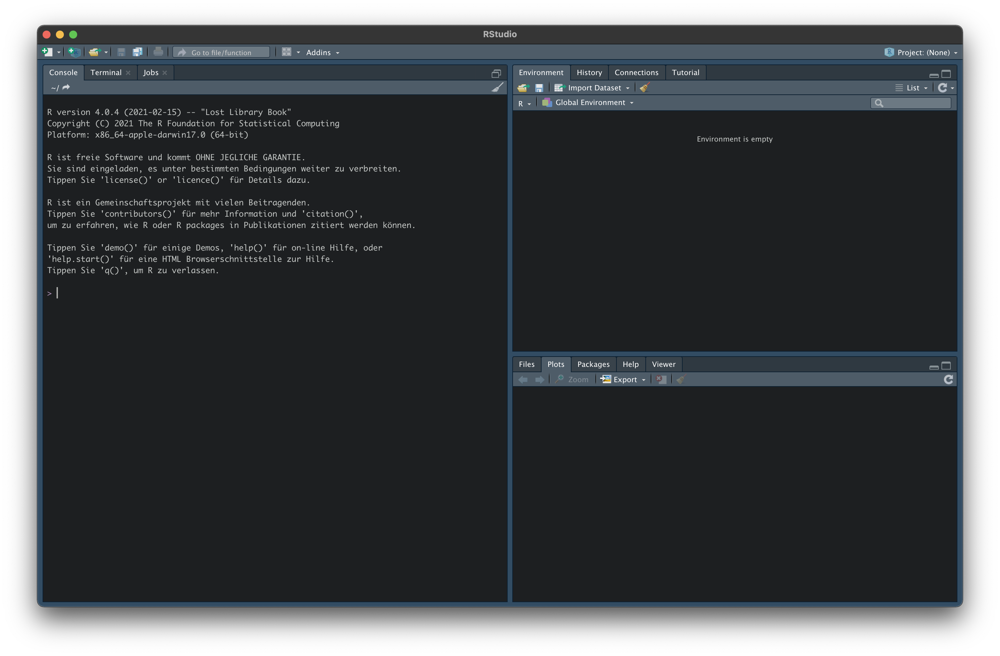
```

::: {.callout-note}
**Hintergrund: RStudio und Posit.** RStudio ist die *integrierte Entwicklungsumgebung* für R. Die IDE heißt weiterhin **RStudio**, die Firma dahinter wurde 2022 in **Posit** umbenannt. Wenn du im Web Verweise auf „RStudio Cloud" findest, sind sie heute unter [posit.cloud](https://posit.cloud/) zu finden.
:::

### Optionen für reproduzierbares Arbeiten

Bevor du intensiv mit RStudio arbeitest, deaktiviere unter `Tools` → `Global Options` zwei Komfort-Features, die im Forschungsalltag mehr schaden als nützen:

1. *Restore .RData into workspace at startup* — deaktivieren.
2. *Save workspace to .RData on exit* — auf *Never* stellen.

Damit musst du bei jedem Neustart Daten und Variablen neu laden — der Vorteil ist ein wirklich frischer Workspace ohne unsichtbare Altlasten aus früheren Sitzungen. Das ist die Grundlage für *reproduzierbares Arbeiten*: deine Analyse darf nur von dem abhängen, was im Skript steht.

```{r, echo=FALSE, fig.align='center', out.width="75%"}
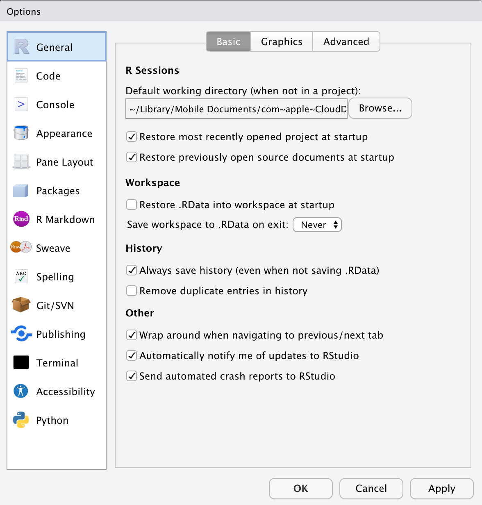
```

Wer es lieber dunkel mag: Unter `Appearance` findest du Farbschemata für Editor und Konsole.

### Konsole

Die Konsole ist dein **erstes Übungsfeld**: Hier kannst du Eingaben direkt ausprobieren. Das `>`-Zeichen ist die Eingabeaufforderung (*prompt*), und du kannst R wie einen Taschenrechner nutzen:

```{r}
2 + 3
```

```{r, echo=FALSE, fig.align='center', out.width="75%"}
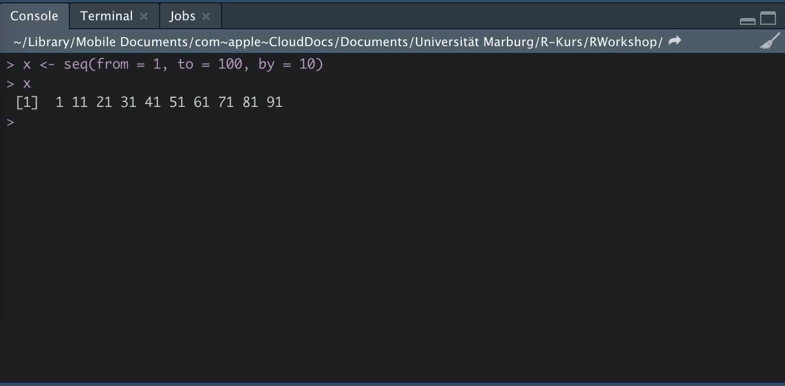
```

Was du in der Konsole tippst, ist allerdings nirgends dauerhaft gespeichert. Sobald du eine Analyse *behalten* willst, gehört sie in ein **R-Skript** (siehe @sec-r-skript).

### Environment und History

Im Reiter `Environment` findest du das **Global Environment** (Dropdown). Hier werden alle Objekte (Variablen, Datensätze, Funktionen), die du angelegt hast, gespeichert.

```{r, echo=FALSE, fig.align='center', out.width="75%"}
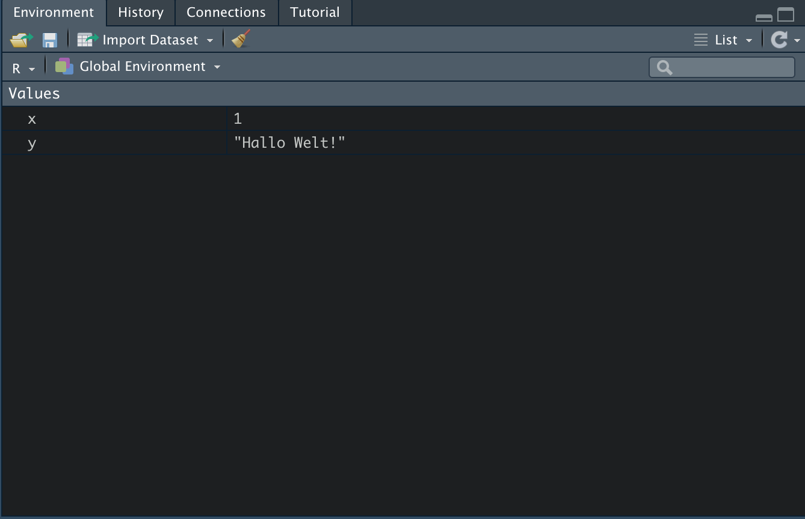
```

Unter `History` siehst du alle Befehle, die du bisher ausgeführt hast. Per Doppelklick werden sie zurück in die Konsole kopiert und können dort modifiziert oder erneut ausgeführt werden.

::: {.callout-tip}
**Tipp.** Die History rufst du auch direkt über die Tastenkombination `cmd` (macOS) bzw. `strg` (Windows) + `↑` in der Konsole ab.
:::

### Files

Unter `Files` siehst du den Datei-Browser deines Arbeitsverzeichnisses. Das Arbeitsverzeichnis (*working directory*) brauchst du in der Praxis fast nie selbst zu setzen, sobald du mit einem **Project** arbeitest — siehe @sec-projects.

```{r, echo=FALSE, fig.align='center', out.width="75%"}
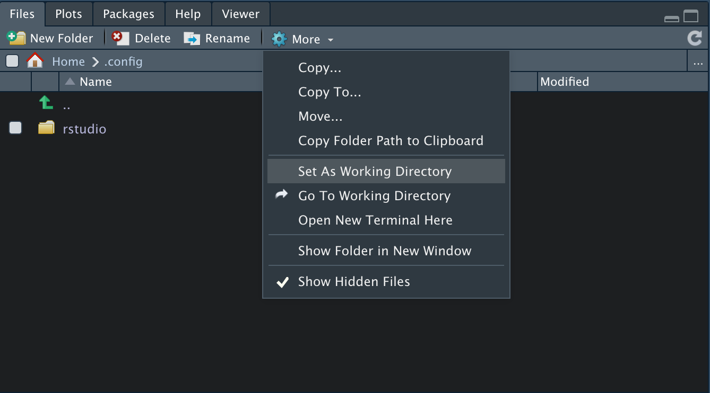
```

## Mit RStudio arbeiten

Jetzt geht es an die praktische Arbeit. Drei Konzepte sind zentral: das **Projekt** als Container, das **R-Skript** als Arbeitsmedium und die **Tastenkürzel** als Beschleuniger.

### Projekt anlegen {#sec-projects}

Bevor du mit Daten arbeitest, lohnt es sich, ein **Project** anzulegen. Über `File` → `New Project` → `New Directory` → `New Project` öffnest du die entsprechende Maske, vergibst einen Namen und einen Speicherort.

```{r, echo=FALSE, fig.align='center', out.width="75%"}
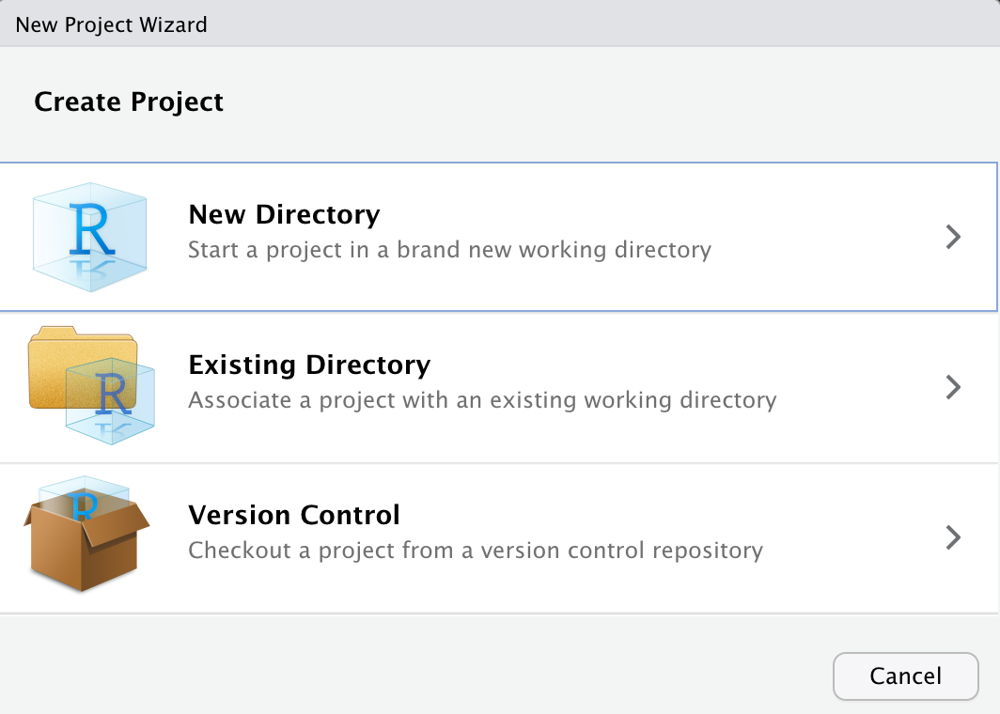
```

Was du davon hast:

- Alle geöffneten *Files* werden beim Start des Projekts (per Doppelklick auf die `.Rproj`-Datei) wieder geladen.
- Du kannst beliebig viele Projekte parallel öffnen und zwischen ihnen wechseln.
- Das Arbeitsverzeichnis ist automatisch der Projektordner — du musst dich nicht mehr darum kümmern, vollständige Pfade einzutippen.

Schiebe deine Datensätze (etwa `ALLBUS2023.sav`, sobald du ihn hast) in den Projektordner, und du kannst sie direkt mit `read_spss("ALLBUS2023.sav")` einlesen.

### R-Skript: dein zentrales Arbeitsobjekt {#sec-r-skript}

Ein **R-Skript** ist eine Textdatei mit der Endung `.R`, in der du deinen Code untereinander schreibst und kommentierst. Es ist das Pendant zur SPSS-Syntax-Datei — nur mächtiger, weil R selbst eine vollständige Programmiersprache ist.

Ein neues Skript öffnest du über das Symbol mit dem weißen Blatt und grünem Kreuz (oben links) — oder per Tastenkürzel `cmd`/`strg` + `shift` + `N`.

::: {.callout-tip}
**SPSS → R.** Das R-Skript ist das Pendant zur SPSS-Syntax-Datei. Du arbeitest weiterhin *in der Syntax* — nur in einer anderen Sprache. Die meisten SPSS-Workflows lassen sich Schritt für Schritt übertragen, oft sogar in weniger Zeilen.
:::

Ein erstes Beispiel — schreibe in dein Skript:

```{r, results='hide'}
var1 <- 2 + 3
var1
```

Mit `Run` (oder `cmd`/`strg` + `Enter`) führst du die aktuelle Zeile aus. Der Output erscheint in der Konsole:

```{r, echo=FALSE}
var1 <- 2 + 3
var1
```

`var1` ist jetzt im `Environment` sichtbar — mit dem Wert `5`. Was eine Variable genau ist, wie Funktionen aufgerufen werden und welche Datentypen R kennt, lernst du in Kap. 3.

::: {.callout-warning}
**Vorsicht: Zuweisungsoperator.** Für Zuweisungen verwendest du `<-`, nicht `=`. Das `=` funktioniert zwar in vielen Fällen auch — es führt aber in komplexeren Kontexten (Funktionsargumenten) zu subtilen Bugs. Mach dir die Konvention `<-` zur Gewohnheit.
:::

### Tab Completion

RStudio hat eine sehr hilfreiche Funktion: *Tab Completion*. Während du tippst, erscheint ein Dropdown mit Vervollständigungs-Vorschlägen. Du kannst es jederzeit über die `Tab`-Taste aufrufen. Tippst du zum Beispiel `w_mean`, schlägt RStudio dir gleich die mariposa-Funktion vor.

```{r, echo=FALSE, fig.align='center', out.width="75%"}
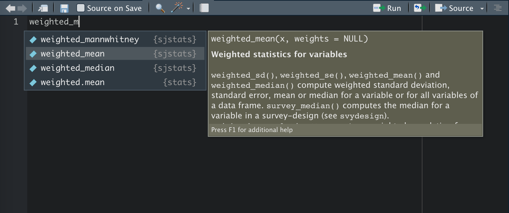
```

Stehst du innerhalb der Klammern einer Funktion und drückst `Tab`, listet RStudio alle Argumente auf. Funktionsargumente sagen einer Funktion, *welche* Daten verarbeitet werden und *wie*. In mariposa-Funktionen heißt das erste Argument typischerweise `data`, gefolgt von den interessierenden Variablen und optional `weights = wghtpew` für eine Gewichtung.

```{r, echo=FALSE, fig.align='center', out.width="75%"}
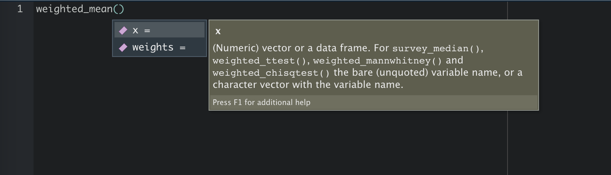
```

Wenn sich zwei Pakete eine Funktionsbezeichnung teilen, kannst du die Mehrdeutigkeit über den Paket-Präfix auflösen — `paketname::funktion`. Das erzeugt auch eine Funktionsliste, wenn du nach `::` `Tab` drückst:

```{r, echo=FALSE, fig.align='center', out.width="75%"}
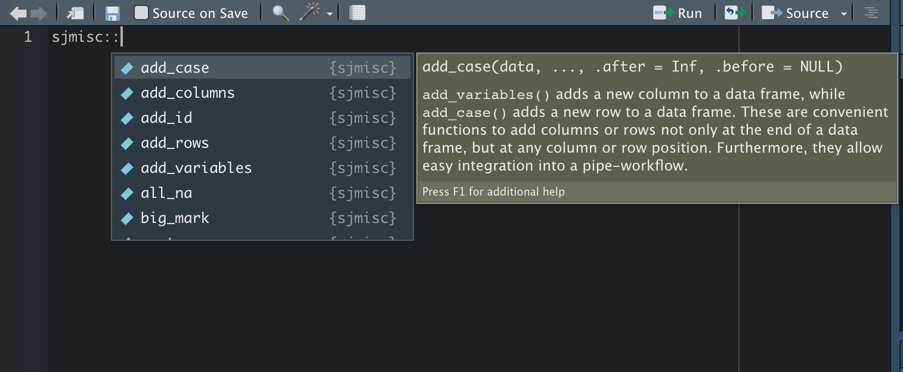
```

### Nützliche Tastenbefehle

Diese Tastenkombinationen sparen dir auf Dauer viel Zeit:

| Befehl                            | Wirkung                          | Wann nützlich                          |
| :-------------------------------- | :------------------------------- | :------------------------------------- |
| `cmd`/`strg` + `Enter`            | Aktuelle Zeile ausführen         | Im Skript                              |
| `cmd`/`strg` + `S`                | Skript-Datei speichern           | Nach jeder Änderung                    |
| `cmd`/`strg` + `shift` + `N`      | Neues Skript erstellen           | Neue Analyse                           |
| `cmd`/`strg` + `shift` + `Enter`  | Gesamtes Skript ausführen        | Vollständiger Re-Run                   |
| `cmd`/`strg` + `↑`                | Vorherige Befehle anzeigen       | In der Konsole                         |
| `control`/`strg` + `L`            | Konsole leeren                   | Wenn es unübersichtlich wird           |
| `cmd`/`strg` + `shift` + `C`      | Zeile als Kommentar setzen       | Code kurz deaktivieren                 |
| `cmd`/`strg` + `shift` + `A`      | Code-Block re-strukturieren      | Eingerückten Code aufräumen            |
| `option`/`alt` + `-`              | Zuweisungspfeil `<-` erzeugen    | Statt manuell tippen                   |
| `cmd`/`strg` + `shift` + `M`      | Pipe `|>` erzeugen               | Beim Pipe-Schreiben (siehe Kap. 3)     |

::: {.callout-tip}
**Tipp.** Eine vollständige Liste aller verfügbaren Tastenkürzel bekommst du in RStudio über `option`/`alt` + `shift` + `K`.
:::

::: {.callout-note}
**Hintergrund: `|>` oder `%>%`?** RStudio bietet seit Version 2021.09 den nativen Pipe `|>` (verfügbar ab R 4.1). Davor war der magrittr-Pipe `%>%` Standard. Wir verwenden in diesem Buch durchgängig `|>`. Unter `Tools` → `Global Options` → `Code` kannst du einstellen, welcher Operator beim Shortcut eingefügt wird — wir empfehlen die *native pipe*.
:::

## Pakete

R bringt von Haus aus — als *base R* — schon eine ganze Reihe nützlicher Funktionen mit. Für viele Analyseschritte sind sie aber zu abstrakt: Wir greifen deshalb auf zusätzliche **Pakete** zurück, die unsere Funktionsbibliothek erweitern. In diesem Buch arbeiten wir bewusst mit nur zwei Ökosystemen: dem **tidyverse** für Datenmanipulation und Visualisierung und **mariposa** für die statistische Analyse.

### Installation

Das tidyverse ist auf CRAN, dem zentralen R-Paket-Archiv, verfügbar und lässt sich direkt installieren:

```{r, eval=FALSE}
install.packages("tidyverse")
```

Damit hast du in einem Schritt die Pakete `dplyr`, `tidyr`, `ggplot2`, `readr`, `purrr`, `tibble`, `stringr`, `forcats` und `lubridate` installiert.

mariposa wird derzeit über GitHub vertrieben. Du brauchst dafür einmalig das Paket `remotes`:

```{r, eval=FALSE}
install.packages("remotes")
remotes::install_github("YannickDiehl/mariposa")
```

Für die Grafik-Kombinationen in Kap. 7 brauchst du außerdem noch `patchwork`:

```{r, eval=FALSE}
install.packages("patchwork")
```

### Aktivierung

Installierte Pakete musst du in jeder R-Sitzung mit `library()` aktivieren:

```{r, eval=FALSE}
library(tidyverse)
library(mariposa)
library(patchwork)
```

Alternativ kannst du Pakete auch über den Reiter `Packages` (rechts unten in RStudio) installieren und aktivieren — das ist gut für einen schnellen Überblick, aber für reproduzierbares Arbeiten ist der Code-Weg besser.

```{r, echo=FALSE, fig.align='center', out.width="75%"}
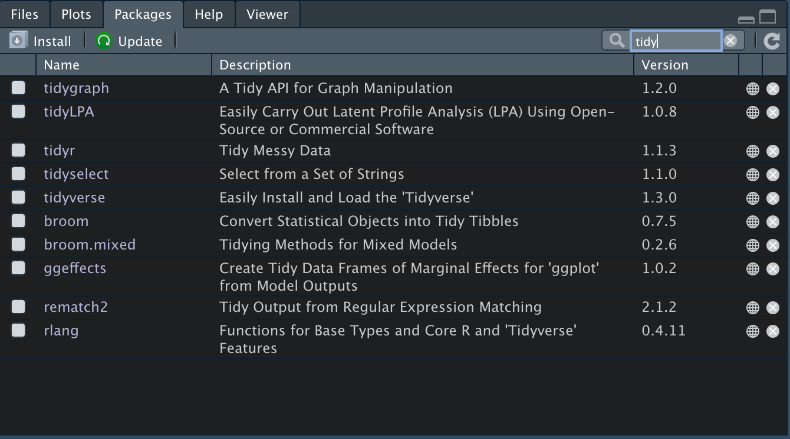
```

### Pakete aktuell halten

Updates lassen sich über den Reiter `Packages` oder per Code anstoßen:

```{r, eval=FALSE}
update.packages(ask = FALSE)                       # alle CRAN-Pakete aktualisieren
remotes::install_github("YannickDiehl/mariposa")   # mariposa nachziehen
```

::: {.callout-warning}
**Vorsicht.** Wenn du in der Mitte eines Projekts ein Paket aktualisierst, ändert sich potenziell das Verhalten deiner Funktionen. Pflege Pakete *zwischen* Projekten oder dokumentiere die genutzten Versionen mit `sessionInfo()`.
:::

## Hilfe finden

Auch wer täglich mit R arbeitet, kann sich nicht alle Funktionen merken. R bietet dir deshalb über den Reiter `Help` eine vollständige Funktionsreferenz. Manche Einträge wirken am Anfang sperrig, sind nach einiger Übung aber die zuverlässigste Quelle.

```{r, echo=FALSE, fig.align='center', out.width="75%"}
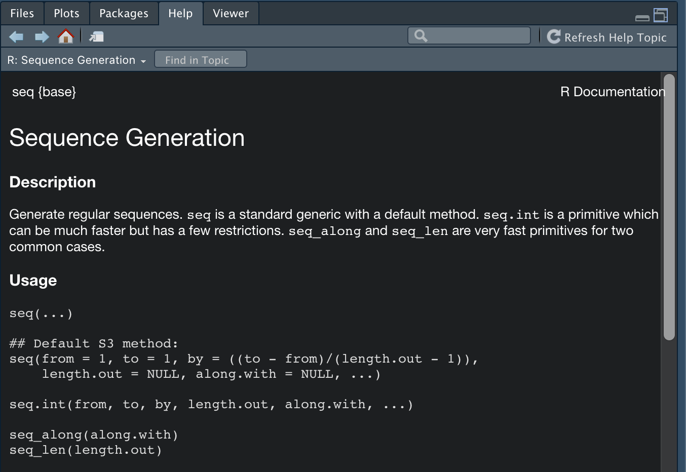
```

Wenn du eine Funktion im Kopf hast, geht es am schnellsten über die Konsole — ein Fragezeichen vor den Funktionsnamen reicht. Hier zum Beispiel für den gewichteten Mittelwert aus mariposa:

```{r, eval=FALSE}
?w_mean
```

Um alle Funktionen eines Pakets aufzulisten, öffnest du den Reiter `Packages`, suchst das Paket und klickst es an. Du landest in der Paketreferenz.

Viele Entwickler:innen pflegen zusätzlich eigene Webseiten für ihre Pakete — das sind oft die besten Einstiegspunkte:

- [tidyverse.org/packages](https://www.tidyverse.org/packages/) — Übersicht aller tidyverse-Pakete mit Vignetten und Funktionsreferenz.
- [yannickdiehl.github.io/mariposa](https://yannickdiehl.github.io/mariposa/) — Funktionsreferenz, Vignetten zu Labels, Gewichtung, deskriptiver Statistik, Korrelation, Regression, Skalenanalyse und SPSS-Kompatibilität.

::: {.callout-tip}
**Tipp: Vignetten.** Eine **Vignette** ist ein längerer Anwendungs-Artikel zu einem Paket — typischerweise mit durchgerechnetem Beispiel, in das Paket eingebettet. Auf den Paket-Webseiten findest du sie unter *Articles*; direkt in RStudio rufst du sie mit `vignette("name")` auf oder listest alle Vignetten eines Pakets mit `browseVignettes("paketname")`.
:::

Wenn du im Web nach Hilfe suchst, ist [Stack Overflow](https://stackoverflow.com/questions/tagged/r) die zentrale Anlaufstelle. Ergänze deine Suchanfrage mit dem Schlagwort *Stack Overflow* — fast jedes typische R-Problem wurde dort schon einmal beantwortet.

## Übungen {-}

::: {.callout-tip collapse="true"}
**Übung 1 — Projekt anlegen (Reproduktion).** Lege ein neues Project mit dem Namen `R-Workshop` an. Falls du den ALLBUS schon hast, schiebe `ALLBUS2023.sav` in den Projektordner. Schließe RStudio, doppelklicke die `.Rproj`-Datei und prüfe, ob alles wieder da ist.
:::

::: {.callout-tip collapse="true"}
**Übung 2 — Erstes Skript (Reproduktion).** Erstelle ein neues R-Skript (`cmd`/`strg` + `shift` + `N`), schreibe drei Zeilen — eine Rechnung, eine Zuweisung, einen Aufruf der zugewiesenen Variable — und führe sie nacheinander mit `cmd`/`strg` + `Enter` aus.

**Lösung:**
```{r ex2-loesung, eval=FALSE}
2 + 3
ergebnis <- 2 + 3
ergebnis
```
:::

::: {.callout-tip collapse="true"}
**Übung 3 — Pakete installieren und Tab Completion testen (Transfer).** Installiere (falls noch nicht geschehen) `tidyverse` und `mariposa`, aktiviere sie und tippe in der Konsole `mariposa::` gefolgt von `Tab`. Welche Funktionen schlägt RStudio dir vor? Welche fünf sehen für dich besonders nützlich aus, was vermutest du, was sie tun?

**Lösung:**
```{r ex3-loesung, eval=FALSE}
install.packages("tidyverse")
install.packages("remotes")
remotes::install_github("YannickDiehl/mariposa")
library(tidyverse)
library(mariposa)
mariposa::   # <- nach den :: TAB drücken
```
:::

::: {.callout-tip collapse="true"}
**Übung 4 — Setup für eigene Forschung (Mini-Forschungsfrage).** Stell dir vor, du willst eine kleine empirische Untersuchung beginnen — etwa zu Wahlverhalten, Klimaeinstellungen oder politischem Vertrauen in Deutschland. Welche Schritte würdest du *jetzt* in RStudio tun, um sauber loszulegen?
Formuliere für dich in 4–5 Stichpunkten den idealen Startablauf — Project anlegen, Pakete laden, Skript-Konvention, Daten ablegen, README erstellen. Wende ihn auf deinen eigenen Workshop-Ordner an.

*Keine Musterlösung — der Sinn ist, von Anfang an mit den eigenen Forschungs­interessen zu rechnen.*
:::

## Was du jetzt weißt {-}

- Du kennst die wichtigsten Bereiche der RStudio-Oberfläche und hast sie auf reproduzierbares Arbeiten eingestellt.
- Du legst Projekte an und nutzt das automatische Arbeitsverzeichnis.
- Du arbeitest in R-Skripten — der reproduzierbaren Form, statt nur in der Konsole zu tippen.
- Du installierst, aktivierst und aktualisierst Pakete — insbesondere tidyverse und mariposa.
- Du findest Hilfe über `?funktion`, Paket-Webseiten und Vignetten.
- Du nutzt die wichtigsten Tastenkürzel routiniert.

Im nächsten Kapitel lernst du **Quarto** kennen — das genau diese RStudio-Skripte mit reproduzierbaren Berichten verbindet. Aus deinem Code und deinem Fließtext entsteht ein Dokument, das du als HTML, PDF oder Word veröffentlichen kannst.

## Weiterführend {-}

- Posit, [RStudio User Guide](https://docs.posit.co/ide/user/) — Vollreferenz zur IDE.
- Posit, [RStudio Cheatsheets](https://posit.co/resources/cheatsheets/) — kompakte PDFs zu Shortcuts, tidyverse, ggplot2 und vielen weiteren Themen.
- [Stack Overflow — Tag `r`](https://stackoverflow.com/questions/tagged/r) — die größte R-Frage-Antwort-Datenbank.
