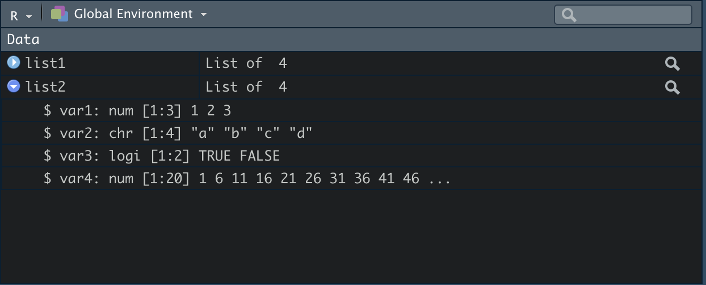

# Programmiersprache R

In diesem Kapitel wollen wir R als Programmierspache kennenlernen.

## Variablen definieren

In einem ersten Schritt wollen wir eine Rechnung (einen Wert) in einer Variable speichern.

```{r, echo=T, collapse=T, comment="#>"}
var1 <- 2*4
```

Unsere Variable mit dem Namen `x` (immer links in der Zeile) wird über den Zuweisungspfeil `<-` (Tastenkürzel: `option` + `-`) mit dem Ergebnis aus `2*4 (8)` definiert.

Zur Kontrolle können wir `x` mit den folgenden Befehlen aufrufen.

```{r, echo=T, collapse=T, comment="#>"}
var1
```

Man kann auch gleich bei der Definition der Variablen die Zuweisung in Klammern schreiben und das Resultat wird gleichzeitig in der Konsole angezeigt.

```{r, echo=T, collapse=T, comment="#>"}
(var1 <- 2*4)
```

**Tipp:** Sollten Sie aus anderen Programmiersprachen schon Kenntnisse mitbringen und `=` als Zuweisungsoperator kennen, empfehlen wir dennoch eindringlich mit `<-` zu arbeiten. Funktionen in R arbeiten bei der Zuweisung von Argumenten mit dem Zuweisungsoperator `=`. Folglich ist die Verwendung von `<-` nicht nur besser zu lesen, sie kann auch Fehler vorbeugen.

### Variablennamen

Eine Variable muss immer einen Namen haben. Sie darf aus Buchstaben, Zahlen und den Zeichen `.` und `_` bestehen. Dennoch muss sie immer mit einem Buchstaben beginnen und darf keine Leerzeichen enthalten.

Um lesbaren und verständlichen Code zu schreiben, gibt es ein paar Konventionen an die man sich halten sollte. Hier gibt es zwei gängige Möglichkeiten und eine ältere Form, um Variablen zu bennen. 

*Die Wahl ist egal, solange man konsequent bei einer Schreibweise bleibt!*

**1. snake_case_variable**

Bei dieser Schreibform werden die einzelnen Worten in einer Variablenbezeichnung durch Unterstriche verbunden und alle Worte kleingeschrieben. 

**2. camelCaseVariable**

Hier wird nur das erste Wort kleingeschrieben und die folgenden mit dem ersten Buchstaben großgeschrieben.

**3. variable.with.perdiods (alt)**

Die kleingeschriebenen Worte werden mit Punkten getrennt.

```{}
# Gute Bezeichnungen
efaKonstrukt1
efa_konstrukt_1

# Schlechte Bezeichnungen
Efa.konstrukt_1
efaKonstrukt_1

# Unmöglich
efa 1
```

## Funktionen  aufrufen

> "Everything that exists is an object. Everything that happens is a function call".
>
>--John Chambers

Objekte haben wir schon in ihrer einfachsten Form als Rechenergebnis in einer Variable kennengelernt. Um kompliziertere Objekte verstehen zu können, wollen wir uns erst den Funktionen (function calls) in R zuwenden. 

Unsere Funktion sieht wie folgt aus (ein fiktionales Beispiel):

```{}
functionName(arg1 = Daten, arg2 = option1, arg3)
```

In einem ersten Schritt sehen wir uns an, welchen Namen die Funktion trägt. Unsere Funktion heißt functionName. Wir können leider nicht direkt aus dem Namen erschließen, welche Auswirkung unser *function call* haben wird. In so einem Fall würde ein Blick in `Help` (`?functionName`) sicher Abhilfe schaffen, wenngleich wir in unserem Beispiel leider keine Dokumentation nutzen können. 

So sehen wir uns in einem zweiten Schritt die *Argumente* unserer Funktion an. Wie wir sehen können, besitzt unsere Funktion drei Argumente: `arg1`, `arg2` und `arg3`. Die Argumente werden mit spezifischen Werten über `=` bestückt. In unserem Beispiel benötigt das erste Argument Daten und das zweite Argument einen spezifischen Wert aus einer Auswahl an möglichen Werten - diese werden immer vom Entwickler der Funktion in der Dokumentation angegeben. Das dritte Argument wird als "default" abgerufen, also über eine Voreinstellung der Entwicklers geladen. Argumente die mit "default" arbeiten sind aber keinesfalls fest. Sie können immer auch durch andere Werte ersetzt werden. Argumente arbeiten immer dann mit "default", wenn die Grundeinstellung des Arguments die häufigste Nutzungsform darstellt und man nicht bei jedem *function call* die Wertzuweisung von neuem schaffen möchte. 

**Tipp:** Wollen wir alle verfügbaren Argumente in einer Funktion sehen, drücken wir `Tab`.

**Wichtig!** Eine Funktion kann beliebig viele Argumente besitzen.

Um uns einer "großen" Funktion zu nähern, müssen wir zu Beginn einige "Grundfunktionen" kennenlernen.

* `c()` > Combine: kreiert einen Vektor 
* `seq(from, to, by)` > Generiert eine Sequenz an Zahlen
* `:` > Colon Operator: generiert eine reguläre Sequenz (Sequenz in Einerschritten)
* `rep(x, times, each)` > Wiederholt x 
                          times: Sequenz wird n-mal wiederholt
                          each: jedes Element wird n-mal wiederholt
* `head(x, n = 6)` > Zeigt die n ersten Elemente von x an
* `tail(x, n = 6)` > Zeigt die n letzten Elemente von x an
* `print(x)` > Gibt Werte eines Objekts aus (vor allem bei großen Objekten wichtig)
* `round(x, digits)` > Rundung von Zahlen

z.B.

```{r, echo=T, collapse=T, comment="#>"}
# Daten erzeugen
# Vektor erzeugen
c(1, 2, 3, 4, 5)

# Sequenz erzeugen
seq(from = 1, to = 10, by = 2)

# Reguläre Sequenz erzeugen
1:5

# Wiederholt 2 ganze 3-mal in 5 Schleifen
rep(x = 2, times = 5, each = 3)

# Überblick über die erzeugten Daten
# Vektor in var1 speichern
var1 <- c(1, 2, 3, 4, 5, 6, 7, 8, 9, 10)

# Ersten 6 Elemente in var1
head(x = var1, n = 6)

# Letzten 4 Elemente in var1
tail(x = var1, n = 4)

# Alle Elemente in var1
print(x = var1)

# Daten transformieren
var2 <- c(1.222, 2.333, 3.444)

# var2 wird auf eine Nachkommastelle gerundet
round(x = var2, digits = 1)
```

Wir wollen uns die Variable `y` etwas genauer ansehen. y enthält durch das Aufrufen der Funktion `c()` eine Reihe von Zahlen (1.222 bis 3.444) mit drei Nachkommastellen. Diese Zahlen wollen wir mit der Funktion `round()` auf eine Nachkommastelle runden. Das Argument `digits` beschreibt damit die Rundungszahl nach dem Komma. `digits = 1` löst eine Rundung der Nachkommastellen auf die erste Nachkommastelle aus. Der Wert im Argument `digits` kann damit theoretisch von 0 bis ∞ variieren. 

### Verschachtelung von Funktionen

Zudem können wir beliebig viele Funktion ineinander verschachteln, d.h. wir können den Output einer Funktion einer anderen Funktion als Input übergeben. 

Wir bilden zuerst einen Vektor, runden die Zahlen und lassen uns dann nur die ersten drei Zahlen ausgeben.

```{r, echo=T, collapse=T, comment="#>"}
# Mehrere Funktionen hintereinander
var1 <- c(1.11, 1.22, 1.33, 1.44, 1.55)
var1 <- round(x = var1, digits = 1)
head(x = var1, n = 3)

# jetzt in einer verschachtelten Funktion
head(x = round(x = c(1.11, 1.22, 1.33, 1.44, 1.55), digits = 1), n = 3)

# kürzeste Form
head(round(c(1.11, 1.22, 1.33, 1.44, 1.55), digits = 1), n = 3)

# Mit var1 als Dateninput
head(round(var1, digits = 1), n = 3)
```

Die Funktionen werden immer in Reihenfolge *von innen nach außen* ausgeführt. In unserem Beispiel also erst `c()`, dann `round()` und dann `head()`. Jede Funktion gibt ihren Wert an die nächste Funktion weiter. 

**Anmerkung:** Die Funktion `head()` enthält zwei Argumente mit "default"-Werten: keepnums und addrownums. Beide bekommen automatisch ("default") den Wert `NULL` und müssen damit nicht ausgeschrieben werden. Sie werden für unsere Anwendung auch nicht gebraucht und damit nicht angepasst. 

Vorteile von verschachtelten Funktionen:

* Es können unendlich viele Funktionen verschachtelt werden. 
* Wir müssen Argumente nicht ausschreiben, solange sie eindeutig von der Funktion erkannt werden können. So gibt es in allen genutzten Funktionen mit `x =` nur eine Schnittstelle für die Dateneingabe. 
* Weiterhin können wir so unseren Code in eine Kette von Befehlen verwandeln, die nur einen Output (ein Objekt) ausgibt. Die Objektstruktur wird damit übersichtlicher. 

Nachteil:

* Wenn wir mehrere Funktionen ineinander verschachteln, kann unser Code schnell unlesbar werden. Natürlich könnten wir die einzelnen Zwischenschritte speichern, wie im Beispiel weiter oben, aber dann definieren wir eine Menge Variablen, welche wir vielleicht gar nicht benötigen. 

*Wir werden im Kapitel über Datentransformation einen neuen Operator kennenlernen, welcher eine sehr elegante Lösung für dieses Problem bietet.*

## Objekte und Datentypen 

In R kann alles als Objekt in Variablen gespeichert werden.

* Einzelne Werte / Mehrere Werte (z.B. ein Datensatz mit Rohdaten)
* Tabellen
* Statistische Modelle
* Ergebnisse statitischer Analysen
* Funktionen, etc. 

Anmerkung: Objekte sind nicht gleich Variablen, da Objekte nicht gespeichert werden *müssen*. Ein Objekt wird erst dann zur Variable, wenn es eine Bezeichnung über `<-` erhält und damit gespeichert wird. Die Zahlenfolge aus `c(1, 2, 3)` stellt auch schon ein Objekt da.

In R gibt es eine Vielzahl von verschiedenen Objekttypen. Die grundlegenden Objekttypen sind:

### Vektoren (vector)

* Vektoren → ordinale/metrische Variablen
  * numeric (Zahlen)
  * character (Buchstaben)
  * logical (Richtig oder Falsch)
  
Beispiel

```{r, echo=T, collapse=T, comment="#>"}
# Numerischer Verktor (numeric vector) 
var1 <- c(1, 2, 3, 4, 5) 
var1

# Buchstaben Vektor (character vector) 
var2 <- c("Peter", "Yusuf", "Sarah", "Aayana")
var2

# Logischer Vektor (logical vector)
var3 <- c(TRUE, FALSE, NA) 
var3
```

**Tipp:** TRUE bzw. FALSE können mit T bzw. F abgekürzt werden.

Vektoren stellen die fundamentalen Datentypen dar. Alle weiteren Datentypen bauen auf diesen auf. Zudem müssen Vektoren aus denselben Elementen bestehen, d.h. wir können keine `logical` und `character` Elemente in einem Vektor mischen. Sie bilden damit die `atomare Struktur` in R.

* **numeric vector:** Die häufigste Datenform in R. Numerische Vektoren lassen sich zudem weiter unterteilen, in `integer` (ganze Zahlen) und `double` (reele Zahlen - Kommazahlen). Zahlen werden in R praktisch immer als `double` abgelegt (auch die ganzen Zahlen) und müssen somit nie für Berechungen gewandelt werden. 

* **character vector:** Die Elemente dieses Typs bestehen aus Zeichen, welche von Anführungszeichen umgeben werden (entweder ' oder " ). Sie werden auch *strings* genannt.

  Anmerkung: Anführungszeichen dienen in R zur Kennzeichnung von nicht numerischen Werten. Wir müssen also **alle** natürlichen Worte in jedem Kontext in Anführungszeichen schreiben.

* **logical vector:** Die Elemente dieses Typs können nur 3 Werte annehmen:`TRUE`, `FALSE` oder `NA`. Logische Vektoren lassen sich auch numerisch übersetzen in `TRUE = 1` und `FALSE = 0`, damit werden sie auch als `integer` abgelegt. Das wird vor allem bei der Datenselektion relevant.

  Anmerkung: `NA` steht für fehlende Werte.

Vektoren haben folgend drei Eigenschaften:

```{r, echo=T, collapse=T, comment="#>"}
# Modus bzw. Struktur (mode) - Was ist es?
typeof(var1)

# Länge - Wie viele Elemente?
length(var1)

# Attribute (optional) - Zusätzliche Informationen (Metadaten)
attributes(var1) # x wurden noch keine attribute zugeordnet

# ------ Zusatz ------

# Objektbestimmung
class(var1)
```

Nun wollen wir auf die einzelnen Elemente in den Vektoren zugreifen (indizieren). Wir können die einzelnen Elemente eines Vektor mit `[]` anwählen (`subsetting`).

```{r, echo=T, collapse=T, comment="#>"}
zahlenreihe <- c(1, 2.5, 3, 4, 5.77, 6, 7)

# Das erste Element
zahlenreihe[1]

# das fünfte Element
zahlenreihe[5]

# Das letzte Element
zahlenreihe[length(zahlenreihe)]

# Mit - (Minus) können wir gezielt Elemente ausschließen
zahlenreihe[-4]

# Wir können auch Sequenzen auswählen
zahlenreihe[2:5]

# Wir können auch gezielt mehrere Elemente ausschließen oder auswählen
zahlenreihe[-c(1, 4)]

zahlenreihe[c(1, 2, 5)]

# Das Gleiche funktioniert auch mit einem character vector
buchstabenreihe <- c("A", "B", "C", "D", "E")

buchstabenreihe[1]
```

### Faktoren (factor)

* Faktoren  → nominale/ordinale Variablen
  * nominale Variable
  * Kategorien des Faktors = levels (kann Zahlen oder Buchstaben enthalten)

Bisher haben wir `numeric`, `character` und `logical` Vektoren kennengelernt. Ein weiterer Objekttyp wird benötigt, um kategoriale Daten oder Gruppierungsvariablen darzustellen. Dieser Objekttyp wird `factor` genannt. 

Ein `Faktor` ist ein Vektor mit ganze Zahlen (`integer`), welcher eine Beschriftung für die einzelnen Fakttorstufen (`levels`) besitzt. Die Beschriftungen sind letztlich Attribute (`attributes`), die Informationen über die Faktorstufen geben. Ein Beispiel:

```{r, echo=T, collapse=T, comment="#>"}
# Geschlecht als character vector
sex <- c("Mann", "Frau", "Mann", "Frau", "Frau", "Div")
sex

# Modus (mode)
typeof(sex)

# Attribute
attributes(sex)
```

Nun haben wir einen `character vector` mit Informationen über Geschlechter. In einem nächsten Schritt wollen wir diesen Vektor als Faktor definieren.

```{r, echo=T, collapse=T, comment="#>"}
# Geschlecht als Faktor
sexf <- factor(sex, levels = c("Mann", "Frau", "Div"))
sexf

# Geschlecht hat nun den Datentyp integer
typeof(sexf)

# und die Klasse "factor"
class(sexf)

# jetzt sind auch die Attribute definiert
attributes(sexf)
```

Wir haben bei der Definition die `levels` explizit angegeben. Das hätten wir aber nicht machen müssen. R ordnet standardmäßig alle Faktorstufen alphabetisch zu. 

```{r, echo=T, collapse=T, comment="#>"}
# Geschlecht als Faktor
sexf2 <- factor(sex)
sexf2

# Datentyp
typeof(sexf2)

# Klasse
class(sexf2)

# Attribute 
attributes(sexf2)
```

Wir werden Faktoren später häufig bei der Modellierung benötigen z.B. bei Regressionsmodellen mit Dummyvariablen. Die erste Stufe eines Faktors wird von R automatisch als Referenzkategorie bestimmt, wenn wir den Faktor als Prädiktorvariable in ein Modell einbringen. Manchmal wollen wir jedoch eine andere Stufe als Referenzkategorie. In diesem Fall kann man die Reihenfolge der Faktorstufen ändern.

Über `relevel()` kann direkt die Refrenzkategorie bestimmt werden.

```{r, echo=T, collapse=T, comment="#>"}
# Unsere Refrenzkategorie ist gegenwärtig "Mann"
levels(sexf)

# Wir ändern die Refrenkategorie folgend auf "Frau"
sexf <- relevel(sexf, ref = "Frau")
levels(sexf)
```

Mit der Funktion `factor()` lassen sich alle Faktorstufen frei ordnen, solange wir im Befehl alle Faktorstufen benutzen. Die erste Stufe wird folglich zur Refrenzkategorie.

```{r, echo=T, collapse=T, comment="#>"}
# Unsere Refrenzkategorie ist gegenwärtig "Frau"
levels(sexf)

# Wir ändern die Refrenkategorie durch die neue Auflistung unserer level auf "Mann"
sexf <- factor(sexf, levels = c("Mann", "Frau", "Div"))
levels(sexf)
```

Durch die Festlegung einer Variable als Faktor wird diese automatisch dummykodiert und kann umstandslos in ein Modell einbezogen werden. Wir müssen nur die Refrenzkategorie im Blick behalten.

### Datensatz (data frame)

* Datensatz (mehrere Zeilen und Spalten) 
  * Spalten (Vektoren und Faktoren)
  * Zeilen (Fälle, z. B. Versuchspersonen)
  
Nun kommen wir zu dem für uns wichtigsten Objekt in R, dem Datensatz. Ein Datensatz besteht aus Zeilen (rows) und Spalten (columns) **gleicher Länge** und entspricht einem Datensatz in SPSS. 

Die Spalten eines Datensatz sind lediglich Vektoren. Sie können damit `numeric`, `character` und `logical` sein, oder als `factor` auftreten. Numerische Variablen in einem Datensatz sollten demzufolge numerische Vektoren und kategoriale Variablen/Gruppierungsvariablen sollten Faktoren sein. Durch die Mischung von Datentypen innerhalb des Objekts "Datensatz" sprechen wir auch von einer `rekursiven Struktur`.

Datensätze werden traditionell über die Funktion `data.frame()` definiert. Da wir das *tidyverse* nutzen, greifen wir auf eine weiterentwickelte Form zurück - `tibbles` oder `tbl`. tibbles werden über die Funktion `tibble()` definiert und erleichtern so die Arbeit mit dem Datensatz. 

**Anmerkung:** Der Vorteil liegt beim Einlesen von Datensätzen, da weniger Rücksicht auf die Datenstruktur genommen werden muss. Durch `tibbles` wird viel durch R automatisiert.

Erstellung eines Datensatz.

```{r, include=F}
library(tidyverse)
```


```{r, echo=T, collapse=T, comment="#>"}
# Vektoren
sex <- factor(c("Mann", "Frau", "Mann", "Mann", "Frau", "Mann"))
alter <- c(22, 45, 67, 87, 16, 56)

# Datensatz
datensatz <- tibble(sex, alter)
datensatz

```

Unser `datensatz` ist damit ein Datensatz mit zwei Variablen (`sex` und `alter`) und sechs Fällen (rows). Dieser wird uns entsprechend im `Environment` angezeigt.

```{r, echo=F, fig.align='center', out.width="75%"}
knitr::include_graphics("Bilder/Datensatz.png")
```

Ein Datensatz hat die Attribute `names()`, `colnames()` und `rownames()` - [`names()` und `colnames()` bedeuten dasselbe].

```{r, echo=T, collapse=T, comment="#>"}
attributes(datensatz)
```

Wir können zudem sowohl die Länge des Spaltenvektors (Anzahl der Spalten) über `ncol` abfragen, wie auch die Länge des Zeilenvektors (Anzahl der Fälle) über `nrow`. 

```{r, echo=T, collapse=T, comment="#>"}
ncol(datensatz)

nrow(datensatz)
```

#### Datensatz indizieren (subsetting)

Ein Datensatz ist eine 2-dimensionale Struktur aus Spalten und Fällen, die entsprechend indiziert werden kann.

* Einzelne Spalten können über `$` ausgewählt werden.
* Einzelne oder mehrere Elemente, ob Spalten oder Zeilen, können über `[]` ausgewählt werden.

```{r, echo=T, collapse=T, comment="#>"}
# Spaltenname zur Auswahl einer spezifischen Variable über $
datensatz$sex

# Spaltenname zur Auswahl einer spezifischen Variable über []
datensatz["sex"]

# Nach Position auswählen
datensatz[2]
```

Wir können aber auch mehrer Variablen und sogar Zeilen (Fälle) auswählen. Sobald wir die Werte in `[]` durch ein Komma trennen, gibt der erste Wert die Zeilen und der zweite die Spalten an. Ohne Komma nur die Spalten.

```{r, echo=T, collapse=T, comment="#>"}
# Erste Spalte und erste Zeile
datensatz[1, 1]

# Erster Fall über alle Spalten (Variablen)
datensatz[1, ]

# Alle Zeilen in der ersten Spalte
datensatz[, 1]

# Wir können auch Sequenzen benutzen
# Ersten drei Fälle über alle Spalten
datensatz[1:3, ]

# Da die Spalten Vektoren sind, können wir diese genauso indizieren
# Erster Fall im Vektor zu Geschlecht
datensatz$sex[1]
          
# Letzten drei Fälle in der Variable alter
datensatz$alter[4:length(datensatz$alter)]

# Die Spalten sex und alter
datensatz[c("sex", "alter")]
```

### Listen (list)

* Listen → in SPSS nicht vorhanden
  * Kombination mehrerer Objekte
  * Listen können beliebige Objekte enthalten, auch Objekte verschiedenen Typs.
  * Im Unterschied zu Datensätzen können auch Objekte unterschiedlicher Länge gespeichert werden.

Ein weiterer Datentyp ist `list`. Während Datensätze schon aus verschiedenen Vektoren bestehen können, lassen sich diese in Listen auch in **verschiedenen Längen** ablegen. Die meisten Objekte die wir im Verlauf unserer R Anwendung kennenlernen werden, sind damit Listen (z.B. die Ergebnisse eines Regressionsmodells werden als Liste gespeichert). Wir müssen aber nur mit ihnen umgehen können und sie verstehen. Wir werden sie praktisch nie selbst erstellen müssen.

In einem ersten Schritt wollen wir dennoch mit der Funktion `list()` eine Liste definieren. So können wir schrittweise verstehen, welche Eigenschaften Listen besitzen.

```{r, echo=T, collapse=T, comment="#>"}
list1 <- list(1:3, "a", c(1.22, 2, 3.44, 4, 5), c(TRUE, FALSE, FALSE))
list1
```

Wir haben mit der Variable `list1` eine Liste erstellt, die als Elemente einen `numeric` Vektor mit einer Zahlenreihe, einen `character` Vektor mit der Länge 1 (L1), einen `numeric`Vektor mit Kommazahlen und einen `logical` Vektor speichert.

Listen können wie Vektoren indiziert werden.

```{r, echo=T, collapse=T, comment="#>"}
# Erstes Element in der Liste (erster Vektor)
list1[1]

# Zweites Element (zweiter Vektor)
list1[2]

# Drittes Element (dritter Vektor)
list1[3]
```

Häufig sind die Elemente in einer Liste als Variablen benannt und können entsprechend wie in einem Datensatz über `$` abgerufen werden.

```{r, echo=T, collapse=T, comment="#>"}
list2 <- list(var1 = c(1, 2, 3),
              var2 = c("a", "b", "c", "d"),
              var3 = c(TRUE, FALSE),
              var4 = seq(from = 1, to = 100, by = 5))

# Ganze Liste abrufen
list2

# Aufruf der ersten Variable mit ihrem Namen var1
list2$var1

# Aufruf der zweiten Variable mit ihrem Namen var2
list2$var2

# Objektbestimmung
typeof(list2)
```

Im `Environment` gibt sich folgende Datenstruktur.

```{r, echo=F, fig.align='center', out.width="75%"}

```

**Wichtig!** Elemente in Listen können unendlich "gestapelt" werden und folgend mit einer Verschränkung des `[]` Operator "entpackt" werden. 

```{r, echo=T, collapse=T, comment="#>"}
list3 <- list(list1 = list1,
              list2 = list(var1 = c(1, 2, 3, 4, 5), 
                           var2 = "a"),
              var1 = 1:100)

# Liste1 aus Liste3 entpacken
list3$list1

# var1 aus liste1 in liste3 entpacken
list3$list1[1]

# var2 aus liste2 in liste3 entpacken
list3$list2$var2

# Erster Wert aus var1 in list1 über list3 entpacken
list3$list1[[1]][1]
```

### Weitere Datentypen

R kennt noch zwei weitere Datentypen (Matrizen und Arrays), die wir in diesem Kurs ausklammern werden. Sofern interesse besteht, verweisen wir auf das Buch von Hadley Wickham: [Advanced R](https://adv-r.hadley.nz/index.html). 

## Pipe Operatoren

In Kapitel 2.2.1 konnten wir schon sehen, dass es schnell unübersichtlich werden kann, wenn wir Funktionen ineinander verschachteln. Vor allem bei der Datenverarbeitung entsteht sehr schnell unübersichtlicher Code. 

Hierfür gibt es in R eine "ganz einfache" Lösung - `Pipes`. So lassen sich Sequenzen von Funktionen sehr elegant abbilden. Eine `Pipe` zeigt sich immer durch den `%>%` Operator an. Um auf diesen zugreifen zu können, müssen wir eig. das Packet *magrittr* laden. Da aber die Packete des tidyverse den Operator automatisch laden, müssen wir zumindest in seiner einfachsten Form keinen zusätzlichen Aufwand betreiben. Nun wollen wir aber mit zwei weiteren Formen des Pipe-Operators arbeiten (`%$%` und `%T>%`), die uns nur über das Laden von magrittr zur Verfügung gestellt werden. 

```{r, include=F}
library(magrittr)
```

```{}
install.packages("magrittr")
library(magrittr)
```

### `%>% Operator` {-}

**Tipp:** Um schnell auf den Pipe Operator zugreifen zu können, bietet sich das Tastenkürzel `cmd bzw. strg` + `up` + `M` an.

Um einen ersten Einstieg zu schaffen, greifen auf unser Beispiel aus Kapitel 2.2.1 zurück. Hier haben wir den Vektor `c(1.11, 1.22, 1.33, 1.44, 1.55)`, welcher in var1 gespeichert wurde, gerundet. 

```{r, echo=T, collapse=T, comment="#>"}
# Vektor speichern in var1

var1 <- c(1.11, 1.22, 1.33, 1.44, 1.55)

# var1 runden

round(var1, digits = 1)
```

In diesem Stadium ist unser Code noch sehr übersichtlich. Wir können aber auch schon jetzt eine `Pipe` zu Demonstrationszwecken bilden. 

```{r, echo=T, collapse=T, comment="#>"}
# Vektor speichern in var1

var1 <- c(1.11, 1.22, 1.33, 1.44, 1.55)

# var1 runden

var1 %>% 
  round(digits = 1)
```

Der Effekt ist für unser Beispiel klein, aber die Idee ist klar. Wir schreiben mit der `Pipe` also Funktionen nicht mehr als `f(x)` sondern als `x %>% f() bzw. x %>% f`. Wir reihen also unsere Funktionen aneinander, wir verschachteln sie nicht mehr.

Im nächsten Schritt wollen wir unseren gerundeten Vektor in eine weitere Funktion übergeben, dann wird auch der Effekt dieses Vorgehens ersichtlich. 

Wir rufen zusätzlich mit `head()` die ersten drei Elemente unseres Vektors auf.

```{r, echo=T, collapse=T, comment="#>"}
# Vektor speichern in var1

var1 <- c(1.11, 1.22, 1.33, 1.44, 1.55)

# var1 runden und die ersten drei Elemente abrufen

head(round(var1, digits = 1), n = 3)

# var1 runden und die ersten drei Elemente abrufen - Pipe

var1 %>% 
  round(digits = 1) %>% 
  head(n = 3)
```

Wie wir sehen können, wird der Vektor var1 durch die Funktionen "weitergegeben". Tatsächlich gibt jede Funktion ihren Output, also ihr Ergebnis, an die nächste weiter. Im ersten Beispiel passiert das von "innen nach außen". Damit wird es schnell unübersichtlich, zumal anstrengend zu schreiben. In der `Pipe` hingegen, erzeugen wir eine lineare Übergabe von Funktion zu Funktion.

Der Ablauf der `Pipe` in Kürze: 

1. Der Vektor aus var1 wird also an die Funktion `round()` weitergegeben und in dieser auf eine Nachkommastelle gerundet. Damit haben wir an diesem Punkt den Output: `c(1.1, 1.2, 1.3, 1.4, 1.6)`. 
2. Im nächsten Schritt wird dieser Output an `head()` übergeben. In `head()` rufen wir nur die ersten drei Elemente ab, also `c(1.1, 1.2, 1.3)`. 

**Vorteile:**

* Unser Code ist lesbarer
* Wir müssen keine unnötigen Variablen definieren

Wir können diesen Prozess auch mit dem Platzhalter-Operator `.` veranschaulichen. Dieser steht immer für den Output aus der letzten Funktion.

```{r, echo=T, collapse=T, comment="#>"}
# Vektor speichern in var1

var1 <- c(1.11, 1.22, 1.33, 1.44, 1.55)

# var1 runden und die ersten drei Elemente abrufen - Pipe

var1 %>% 
  round(x = ., digits = 1) %>% 
  head(x = ., n = 3)
```

Ziemlich schick, nicht wahr? Der Platzhalter lässt sich aber auch an jeder anderen Stelle in der Funktion als Wertcontainer einsetzen. 

```{r, echo=T, collapse=T, comment="#>"}
# Vektor speichern in var1

var1 <- c(1.11, 1.22, 1.33, 1.44, 1.55)

# var1 runden und die ersten drei Elemente abrufen - Pipe

1 %>% 
  round(var1, digits = .) %>% 
  head(x = ., n = 3)
```

**Wichtig!** Wollen wir ohne einen Platzhalter arbeiten, muss das erste Argument der nachfolgenden Funktion den Output der vorherigen aufnehmen können - i.d.R. `x = Daten (Datensatz oder Variablen)`. 

In den meisten Fällen ist auch das Objekt, welches übergeben wird, gleichzeitig das erste Argument der nächsten Funktion (vor allem für die tidyverse-Funktionen), so dass wir diesen Platzhalter selten brauchen werden. Wir haben alle Funktionen in diesem Kurs nach diesem Kriterium ausgewählt, um eine möglichst reibungslose Einarbeitung zu ermöglichen.

**Anmerkung:** Der Verkettung von Funktionen ist damit praktisch kein Limit gesetzt, außer ein paar Regeln an die man sich halten sollte.

`Pipes` sollten nicht genutzt werden, wenn

1. die `Pipe` länger als 10 Schritte wäre,
2. mehrere Inputs oder Outputs benötigt werden,
3. eine komplexe Objektstruktur das Ziel ist.

### `%$% Operator` {-}

Für Funktionen, die auf Variablenebene arbeiten und keinen Datensatz als Dateninput erlauben, gibt es den `%$%` Operator. 

**Wichtig!** Wir brauchen diesen Operator aber nur für ganz wenige Funktionen. Die meisten Funktionen die auf Variablenebene arbeiten, besitzen gleichzeitig auch als erstes Argument eine Datensatz-Schnittstelle - `x = Datensatz`. Sie greifen dann über das zweite Argument auf die Variablen in diesem Datensatz zu.  

Der `%$%` Operator ermöglicht letztlich, dass wir gezielt einzelne Variablen aus dem Datensatz in der nächsten Funktion anwählen können, auch wenn es keine Datensatz-Schnittstelle gibt. 

In unserem Beispiel benötigt die Funktion `ts.plot`, als Grafik für Zeitachsenmessungen, eine Variable als Input - `x = Variable`. Es darf also kein Datensatz eingespeist werden. Folglich brauchen wir den `%$%` Operator, um auf Variablenebene operieren zu können. 

```{r, echo=T, collapse=T, comment="#>", message=T}
# Vektoren in Datensatz speichern

var1 <- c(1, 1, 2, 2, 2, 3, 3, 3, 3)
var2 <- c(8, 9, 1, 1, 2, 3, 4, 5, 4)
ds1 <- tibble(var1, var2)

# Mit dem %$% Operator

ds1 %$%
  ts.plot(var1)
```

### `%T>% Operator` {-}

Dieser Operator ermöglicht es eine `Pipe` auch bei Funktionen ohne "inhaltlichen" Output weiterzuführen. Grafiken haben letztlich keinen Output außer der Grafikausgabe und würden so eine Verkettung von Funktionen beenden. Wollen wir aber zu unserer Grafik noch einen "inhaltlichen" Output, brauchen wir den `%T>%` Operator. Dieser wird hinter den letzten Output geschrieben, auf den wir uns beziehen wollen. Unser Wert wird damit auch an die übernächste Funktion "weitergegeben". 

Es wird also immer auf den linken Wert neben dem `%T>%` Operator zugegriffen und dieser an alle folgenden Funktionen "weitergegeben".

```{r, echo=T, collapse=T, comment="#>"}
var1 <- c(1.11, 1.22, 1.33, 1.44, 1.55)

var1 %>% 
  round(digits = 2) %T>%
  plot() %>% 
  head(n = 3) 
```

So können wir uns einen Grafikoutput, wie auch die ersten drei Elemente von unserem gerundeten Vektor ausgeben lassen.

Hervorangend! Jetzt können wir mit der Bearbeitung unseres Datensatzes beginnen.


