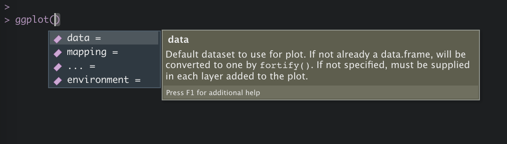

# Grafiken erstellen

In diesem Kapitel werden wir lernen, welche Werkzeuge uns R zur Erstellung von Grafiken zur Verfügung stellt und
wie uns das Paket `ggplot2` aus dem `tidyverse` ermöglicht durch explorative Datenanalyse verborgene Zusammenhänge zu entdecken, sowie 
Resultate darzustellen und zu kommunizieren. 

Im Gegensatz zum ursprünglichen Grafiksystem `R Base Graphics`, welches auf `Base R` aufsetzt, basiert `ggplot2` auf der intuitiven Syntax
`Grammar of Graphics`. Hiermit lassen sich durch eleganten, flexiblen und konsistenten Code sehr komplexe Grafiken erstellen und nahtlos mit den 
Funktionen des `tidyverse` verbinden. 

Achtung! `ggplot2` benötigt Datensätze im *long* Format. (siehe hierzu: [R for Data Science - Tidy Data](https://r4ds.had.co.nz/tidy-data.html))

Da Grafiken mit `ggplot2` immer nach dem gleichen Prinzip erstellt werden, ergeben sich immer folgende Schritte:

**Schritt 1:** Erstellung eines Objekts mit der Funktion `ggplot()`.

**Schritt 2:** Definition der Datengrundlage mit dem ersten Argument `data = datensatz`.

**Schritt 3:** Definition von “aesthetic mappings”, also der Wahl einer Variable für die x-Achse: `x = var1`, y-Achse: `y = var2`, 
Gewichtung: `weight = gewicht` und zur Gruppierung der Daten: `group bzw. colour, shape, linetype oder fill = var3` über die Funktion `mapping = aes()`. 

**Schritt 4:** Definition verschiedener "Layer" bzw. "Schichten". Hierbei definieren wir, was dargestellt werden soll - z.B. ein Histogramm oder Linien. 
Dabei wird uns in der Anzahl an Schichten kein Limit gesetzt. Die Funktionen beginnen dabei immer mit dem Präfix `geom_`, z.B. `geom_bar()` und werden über den
Operator `+` hinzugefügt.

Im Verlauf des Kapitels werden wir die einzelnen Schritte noch einmal vertiefen, gleichwohl wollen wir mit eingängigen Beispiel beginnen.

**Beispiel 1:** 

Grundlage unserer Grafik und damit erstes Argument der Funktion `ggplot()` ist der `allbus2018`. Aufbauend definieren wir in der Funktion `aes()`, welche Variablen in unserer Grafik auf welcher Achse abgebildet werden sollen. Da wir lediglich eine Abbildung der Häufigkeitsverteilung der Variable `im19` anstreben, müssen wir nur das Argument `x =` spezifizieren. Anschließend wird über das Argument `weight =` eine Gewichtung vorgenommen. Damit haben wir unser Fundament gelegt. Über den Operator `+` fügen wir nun weitere Schichte hinzu. Als erstes "Layer" fügen wir über die Funktion `geom_bar` das gewünschte Balkendiagramm hinzu. Die Funktion führt dabei voreingestellt über das Argument `stat = "count"` einen Zählbefehl aus, welcher uns in Folge die Häufigkeitswerte der einzelnen Ausprägungen ausgibt. Als weitere Argumente definieren wir noch die Farbe der Balken mit `fill =` und das Auslassen fehlender Werte über ``. Als Endpunkt fügen wir noch eine zweite Schicht hinzu, die uns mit der Funktion `labs()` ermöglicht alle Achsen frei zu Beschriften. Fertig!

```{r}
allbus2018 %>% 
  drop_na(im19) %>% 
  ggplot(aes(x = im19, weight = wghtpew)) +
  geom_bar(fill = "steelblue") +
  labs(y = "Anzahl", title = "Häufigkeitsverteilung der Variable im19")
```

Die folgende Grafik erweitert unsere Fähigkeiten zusätzlich um vier Punkte. Durch die nahtlose Integration der Funktionen des `tidyverse` und `strengejacke` ist es uns möglich innerhalb eines Objekts sowohl die Daten zu manipulieren, als auch diese in die nachfolgende Grafik einzubeziehen. So war es in unserem Beispiel von Nöten die Grupperungsvariable `sex` (Geschlecht) erst zu einem Faktor zu konvertieren, um sie nachstehend nutzen zu können - Funktion `to_label()`. Weiterhin haben wir das Nettoeinkommen der Befragten mit dem Argument `y =` auf der y-Achse abgebildet und das Geschlecht der Befragten über das Argument `colour =` als Gruppierungvariable gewählt. Damit erlaubt uns `ggplot()` die einzelnen Datenpunkte farblich hervorzuheben, sowie über die Funktion `stat_summary()` einen Mittelwertvergleich zwischen beiden Gruppen über ein Liniendiagramm abzubilden. 

```{r}
allbus2018 %>% 
  to_label(sex) %>% 
  drop_na(age, inc, sex) %>% 
  ggplot(aes(x = age, y = inc, colour = sex, weight = wghtpew)) +
  geom_point(alpha = 0.1) +
  stat_summary(fun = "mean", geom = "line", size = 0.8) +
  labs(x = "Alter", y = "Einkommen", colour = "Geschlecht", 
       title = "Mittleres Einkommen nach Alter und Geschlecht")
```

Nun wollen wir uns die einzelnen Schritte nochmal im Detail ansehen.

## Schritt 1: Plot-Objekt erstellen

```{r, echo=F, fig.align='center', out.width="75%"}

```

Wir beginnen mit einem Datensatz und erstellen ein Plot-Objekt mit der Funktion `ggplot()`. Als erstes Argument fügen wir unseren Datensatz ein `data = datensatz`. Hierbei bestehen zwei Möglichkeiten der Umsetzung.

```{r, echo=T, collapse=T, comment="#>"}
# Ohne Pipe
g <- ggplot(data = allbus2018)

# Mit Pipe
g <- allbus2018 %>% 
  ggplot()
```


## Schritt 2: Aesthetic mapping

Im zweiten Schritt definieren wir das zweite Argument `mapping =` über die Funktion `aes()` - "aesthetic mappings". Damit bestimmen wir welche Variablen benutzt werden sollen, um die Daten darzustellen. Im Folgenden wollen wir ergründen, inwieweit das Geschlecht der Befragten einen Einfluss auf ihr individuelles Nettoeinkommen `(inc)` hat. So definieren wir `sex` als Variable auf der x-Achse mit `x = sex` und die Variable `inc` mit `y = inc` auf der y-Achse. Da wir Gesamtdeutschland betrachten wollen, definieren wir noch mit `weight = wghtpew` das nötige Designgewicht. Der vorläufiger Befehl lautet entsprechend: `mapping = aes(x = sex, y = im21, weight = wghtpew)`. 
Zusätzlich erlaubt die Funktion `aes()` weitere Anpassungen über `fill =`, `colour =`, `shape =`, `linetype =` und `group =`. Diese Argumente helfen zum Einen der Gruppierungsvariable auf der x-Achse eine Farbe, Form oder Zugehörigkeit zuzuweisen, zum Anderen lässt sich damit aber auch eine dritte Variable `(z)` als Gruppierungsvariable (siehe Beispiel 2) zuweisen.

In unserem Beispiel wollen wir, dass die beiden Ausprägungsmerkmale von Geschlecht verschiedene Farben zugewiesen bekommen und die nachfolgenden Objekte entsprechend ausgefülllt werden. Der fertige Befehl lautet damit: `mapping = aes(x = sex, y = inc, weight = wghtpew, fill = sex, colour = sex)`. Das Argument `colour =` ist folglich ein Attribut für Linien und Punkte; das Argument `fill =` ist ein Attribut für Flächen.

**Wichtig!** Wenn wir die Funktion `aes()` innerhalb der Funktion `ggplot()` definieren, gelten sie für alle Schichten, d.h. für alle Elemente der Grafik. Wir können später die "mappings" auch für jede Schicht einzeln definieren und damit auf verschiedene Datensätze zugreifen, oder andere Variablen verwenden.

```{r, echo=T, collapse=T, comment="#>"}
g <- allbus2018 %>% 
  to_label(sex) %>% 
  drop_na(sex, inc) %>% 
  ggplot(mapping = aes(
    x = sex,
    y = inc,
    weight = wghtpew,
    fill = sex,
    colour = sex
    ))
```

`g` ist damit ein "leeres" Plot-Objekt, dass noch nichts anzeigt, da wir noch keine "Layer" definiert haben. Das Objekt ist damit ein `ggplot2`-Objekt, welches im R-Studio Fenster `Plots` ausgegeben werden kann. Wir sehen folglich ein Grafikgerüst mit der richtigen Achsenzuweisung.

```{r, echo=T, collapse=T, comment="#>"}
g
```

## Schritt 3: Schichten ("Layer") hinzufügen

Dem Plot-Objekt `g` wollen wir nun mit den Funktionstypen `geom_` weitere Schichten beifügen. So addieren wir mit dem `+` Operator einfach ein weiteres "Layer" - `g + geom_`.

### Punktdiagramm

Als erstes möchten wir die einzelnen Beobachtungen als Datenpunkte abgetragen haben. Hierbei können wir entweder unsere Ausgangssytax optimieren, oder das Objekt `g` einfach erweitern.

**Anmerkung:** Mit dem Argument `` werden fehlende Werte in den Schichten außen vor gelassen und wir verhindern eine Warnmeldung. 

```{r, echo=T, collapse=T, comment="#>"}
# Ausgangssyntax optimieren
allbus2018 %>% 
  to_label(sex) %>% 
  drop_na(sex, inc) %>% 
  ggplot(mapping = aes(x = sex, y = inc, weight = wghtpew, fill = sex, colour = sex)) +
  geom_point()
  
# Objekt erweitern
g +
  geom_point()
```

Wollen wir das Überlagern der Datenpunkte (overplotting) verhindern, können wir auch auf die Funktion `geom_jitter()` zurückgreifen. In Anwendung werden uns die Punkte nebeneinander gezeigt.

```{r, echo=T, collapse=T, comment="#>"}
g +
  geom_jitter()
```

Mit dem Argument `width =` können wir zusätzlich bestimmen, wie breit die Streuung der Punkte sein soll.

```{r, echo=T, collapse=T, comment="#>"}
g +
  geom_jitter(width = 0.5, )
```

Weitere Argumente sind `size =` für die größe der Punkte und `alpha =` zur Bestimmung der Transparenz. Zudem lassen sich wie gehabt im Fenster `Help` über den Befehl `?geom_jitter` in der Konsole weitere Argumente einsehen. 

```{r, echo=T, collapse=T, comment="#>"}
g +
  geom_jitter(size = 1, alpha = 0.3, )
```

### Zentrale Tendenz und Streuung abbilden

Zur Darstellung der zentralen Tendenz und Streuung gibt uns `ggplot2` zusätzliche Schichten an die Hand. Genannt seien hier `geom_boxplot()` zur Darstellung von Boxplot-Diagrammen und `geom_violin()` für Violin-Diagramme.

```{r, echo=T, collapse=T, comment="#>"}
g +
  geom_boxplot()
```

In einem Boxplot wird der Median abgetragen, d.h. das Rechteck repräsentiert die mittleren 50% und die Striche ("whiskers") zeigen den 1,5 * IQR (Interquantilbereich). Die einzelnen Punkte stellen Ausreisser dar. 

Wollen wir den Median sehen, müssen wir das Argument `fill = sex` weglassen.

```{r, echo=T, collapse=T, comment="#>"}
g <- allbus2018 %>% 
  to_label(sex) %>% 
  drop_na(sex, inc) %>% 
  ggplot(mapping = aes(x = sex,
                       y = inc,
                       weight = wghtpew,
                       colour = sex))

g +
  geom_boxplot()
```

Violin-Diagramme sind Boxplot-Diagrammen sehr ähnlichen, wenngleich sie nicht die Quantile, sondern ein "kernel density estimate" zeigen - d.h. eine Abbildung der Kerndichte. Hier bietet sich das Argument `fill = sex` zudem ideal an. 

```{r, echo=T, collapse=T, comment="#>"}
g <- allbus2018 %>% 
  to_label(sex) %>% 
  drop_na(sex, inc) %>% 
  ggplot(mapping = aes(x = sex,
                       y = inc,
                       weight = wghtpew,
                       fill = sex))

g +
  geom_violin()
```

Stellen wir fest, dass die Farbgebung immer wieder neu angepasst werden muss, sollten wir das mapping entsprechend anpassen.

```{r, echo=T, collapse=T, comment="#>"}
# Ausgang
g <- allbus2018 %>% 
  to_label(sex) %>% 
  drop_na(sex, inc) %>% 
  ggplot(mapping = aes(x = sex,
                       y = inc,
                       weight = wghtpew))
```

```{r, echo=T, collapse=T, comment="#>"}
# Boxplot
g +
  geom_boxplot(aes(colour = sex), )
```

```{r, echo=T, collapse=T, comment="#>"}
# Violin
g +
  geom_violin(aes(fill = sex), )
```

### Mehrere Schichten kombinieren

So ist es uns auch möglich mehrere "Layer" zu kombinieren. So müssen wir lediglich mehrere `geom_` Funktionen mit dem `+` Operator verbinden:

```{r, echo=T, collapse=T, comment="#>"}
g +
  geom_violin(aes(fill = sex), ) +
  geom_jitter(aes(colour = sex), alpha = 0.2, width = 0.4, )
```

## Verschiedene Grafiken für verschiedene Datentypen

In diesem Kapitel wollen wir uns eine Übersicht über die diversen `Geoms` in `ggplot2` für verschiedene Kombinationen von Variablen ansehen. So können wir entweder eine Variable auf der x-Achse oder y-Achse darstellen oder jeweils eine Variable auf der x-Achse und y-Achse. Diese Variablen können sowohl kontinuierlich (metrisch) oder kategorial (nominal/ordinal) sein. 

**Wichtig!** Wir können in diesem Kapitel nur eine spezifische Auswahl der möglichen `Geoms` betrachten, da `ggplot2` sehr umfangreich ist. Für eine umfassende Dokumentation aller Funktionen siehe: [ggplot2 Dokumentation](https://ggplot2.tidyverse.org/reference/). Unser Ziel ist lediglich eine Befähigung zum eigenverantwortlichen Arbeiten und Problemlösung herzustellen und den kreativen Prozess der Datenvisualisierung einzuleiten.

### Eine Variable

Sofern wir nur eine Variable auf der x-Achse abtragen möchten, müssen wir dennoch Werte auf der y-Achse definieren. In diesem Zusammenhang wird es sich mehrheitlich um z.B. Häufigkeitsverteilungen etc. handeln.

#### Kategoriale Variablen

Handelt es sich bei unserer Analyse um eine kategoriale Variable, dann verwenden wir oft einen *bar chart bzw. bar graph*. Hierbei wird die betreffende Variable anhand eines Rechtecks auf der x-Achse abgetragen, wobei es sich häufig um absolute bzw. relative Häufigkeitsverteilungen handelt. Die Funktion, die hierfür verwendet wird, heißt `geom_bar()`.

Als Beispiel ziehen wir die Alterskategorien der Befragten heran.

```{r}
allbus2018 %>% 
  to_label(agec) %>% 
  drop_na(agec) %>% 
  ggplot(aes(x = agec, weight = wghtpew)) +
  geom_bar(fill = "steelblue", colour = "red") 
```

**Merke:** Sofern wir `fill = "steelblue", colour = "red"` nicht innerhalb der `aes()` Funktion verwenden, dann handelt es sich nicht um Gruppierungsvariablen, sondern ausschließlich um Farbgebungen der Grafikobjekte. So färben wir mit `fill = "steelblue"` lediglich die Balken in Stahlblau ein. Eine Übersicht über die verschiedenen Farbvarianten erhalten wir mit der Funktion `colours()`. Es gibt 657, wenn gleich nur Zwanzig im folgenden Output dargestellt werden.

```{r}
colours() %>% sample(20)
```

Im nächsten Schritt wollen wir unser Balkendiagramm nicht mit absoluten Werten ausgeben, sondern mit relativen Häufigkeiten. Hierzu ist es wichtig zu wissen, dass in der vorherigen Grafik ein entscheidendes Argument mit Standardwert eingegangen ist, das wir nun anpassen müssen. So fügen wir der vorherigen Grafik die Argumente `aes(y = ..count..)` hinzu. Wir definieren also auf der y-Achse eine Variable, die unmittelbar aus der x-Achse errechnet werden soll. Mit dem Befehl `..count..` handelt es sich um eine absolute Auszählung der Häufigkeiten. Wollen wir eine relative Häufigkeitsverteilung verwenden wir den Befehl `aes(y = ..prop..)`, also eine proportionale Auszählung. Zudem müssen wir noch definieren aus welcher bzw. wie vielen Gruppe/n die Werte relational geschöpft werden sollen. Dies geschieht über den Befehl `aes(y = ..prop.., group = 1)`. Damit werden die Werte relational bzw. proportinal aus einer Gruppe gebildet und bilden damit Prozentwerte zu 100% ab (die Darstellungsform auf der y-Achse lernen wir in den kommenden Kapiteln)

```{r}
allbus2018 %>% 
  to_label(agec) %>% 
  drop_na(agec) %>% 
  ggplot(aes(x = agec, weight = wghtpew)) +
  geom_bar(aes(y = ..prop.., group = 1), fill = "steelblue", colour = "red") 
```

Weiterhin können wir zusätzliche Gruppierungvariablen angeben, anhand derer die Balken farblich kodiert werden. Im gewählten Beispiel: Geschlecht.

```{r}
allbus2018 %>% 
  to_label(agec, sex) %>% 
  drop_na(agec, sex) %>% 
  ggplot(aes(x = agec, weight = wghtpew, fill = sex)) +
  geom_bar(aes(y = ..prop.., group = sex)) 
```

Standardmäßig kreiert `ggplot2` einen *stacked* Bar Chart, die Balken werden also "gestapelt". Wollen wir hingegen die Balken nebeneinander stehen sehen, können wir das Argument `position = "dodge"` verwenden.

```{r}
allbus2018 %>% 
  to_label(agec, sex) %>% 
  drop_na(agec, sex) %>% 
  ggplot(aes(x = agec, weight = wghtpew, fill = sex)) +
  geom_bar(aes(y = ..prop.., group = sex), position = "dodge") 
```

Kontinuierliche Variablen

Für kategoriale Variablen bieten sich eine Vielzahl von Grafikobjekten an. Beginnen möchten wir mit dem Histogramm, welches die Verteilung einer numerischen Variable idealen abträgt. Dazu werden die Werte einer Variable in diskrete Intervalle (`bins`) eingeteilt. Auf der y-Achse werden dazu, analog zu einem Bar Chart, die Häufigkeiten in den Intervallen abgebildet. Von besonderer Bedeutung ist hier die Bestimmung der Intervallgrößen (`binwidth`), da hierüber die Verteilung maßgeblich beeinflusst wird - die Grundeinstellung liegt bei `bins = 30`. 

Hier ein Beispiel anhand der Altersverteilung in unserer Stichprobe mit den Grundeinstellungen.

```{r}
allbus2018 %>% 
  drop_na(age) %>% 
  ggplot(aes(x = age, weight = wghtpew)) +
  geom_histogram(colour = "red")
```

Wir bestimmen die `binwidth` selbst. Wir legen eine Altersspanne von 2 Jahren pro Balken fest - `binwidth = 1`.

```{r}
allbus2018 %>% 
  drop_na(age) %>% 
  ggplot(aes(x = age, weight = wghtpew)) +
  geom_histogram(binwidth = 1, colour = "red")
```

Die Bestimmung der `binwidth` sollte natürlich immer von der Skala der Variable abhängen und damit weder zu fein noch zu grob ausfallen.

Im nächsten Schritt wollen wir auf der y-Achse die relativen Werte abgetragen sehen. Hierfür verwenden wir das Argument `aes(y = )` mit der zugehörigen Funktion `..density..`, damit `geom_histogram(aes(y = ..density..))`.

```{r}
allbus2018 %>% 
  drop_na(age) %>% 
  ggplot(aes(x = age, weight = wghtpew)) +
  geom_histogram(aes(y = ..density..), binwidth = 5, fill = "steelblue", colour = "black")
```

Zudem lassen sich auch in Histogrammen Gruppierungsvariablen verwenden. 

```{r}
allbus2018 %>% 
  drop_na(age) %>% 
  to_label(sex) %>% 
  ggplot(aes(x = age, weight = wghtpew)) +
  geom_histogram(aes(y = ..density.., fill = sex), binwidth = 5, colour = "black")
```

Wir können die Balken auch über das Argument `position =` übereinander legen mit `position = "identity"`. 

```{r}
allbus2018 %>% 
  drop_na(age) %>% 
  to_label(sex) %>% 
  ggplot(aes(x = age, weight = wghtpew)) +
  geom_histogram(aes(y = ..density.., fill = sex), binwidth = 5, position = "identity", alpha = 0.4)
```

Oder sie nebeneinander behalten `position = "dodge"`.

```{r}
allbus2018 %>% 
  drop_na(age) %>% 
  to_label(sex) %>% 
  ggplot(aes(x = age, weight = wghtpew, fill = sex)) +
  geom_histogram(aes(y = ..density.., fill = sex), binwidth = 5, position = "dodge")
```

### Zwei Variablen 

Jetzt wollen wir zwei Variablen auf der x-Achse und y-Achse abbilden. Auch hier hängen die Möglichkeiten der `geoms` vom Datentyp der Variable ab.

#### X und Y kategorial

Diese Konbination der Datentypen hält recht wenige Möglichkeiten der grafischen Aufbereitung bereit. Legitim ist in jedem Fall der grafische Abtrag der gemeinsamen Häufigkeiten. Hierfür gibt es die Funktion `geom_count()`.

Als interessantes Beispiel dient die gemeinsame Häufigkeit zwischen Alterskategorie und Bildungsabschluss.

```{r}
allbus2018 %>% 
  to_label(agec, educ) %>% 
  drop_na(agec, educ) %>% 
  mutate(agec = str_remove(agec, "JAHRE")) %>%
  ggplot(aes(x = agec, y = educ, weight = wghtpew)) +
  geom_count()
```

Die gemeinsamen Häufigkeiten werden durch `geom_count` vor allem über den Durchmesser der Punkte dargestellt (vgl. Funktion `crosstab()`).

#### X kategorial und Y kontinuierlich

Wenn eine der Variablen kategorial ist, dann können wir diese statt als Gruppierungsvariable auf der x-Achse verwenden. Gute Beispiele waren hierfür die in Kapitel 6.3.2 gezeigten Box- und Violindiagramme. Zudem können wir auch die Funktion `geom_col()` für zwei Variablen nutzen. Diese Funktion ist eng mit `geom_bar()` verwandt, wenngleich sie keine Aggregation der Daten über `stat = "count"` vornimmt, sondern nativ zwei Variablen zulässt und als Grundeinstellung mit `stat = identity` arbeitet. Die Variable auf der y-Achse bildet entsprechend alle Beobachtungen in den Kategorien auf der x-Achse ab. 

Als Beispiel dient uns das Geschlecht der Befragten und ihr individuelles Nettoeinkommen.

```{r}
allbus2018 %>% 
  to_label(sex) %>% 
  drop_na(sex, inc) %>% 
  ggplot(aes(x = sex, y = inc, weight = wghtpew, fill = inc)) +
  geom_col(position = "dodge")
```

#### X und Y kontinuierlich

**Scatterplot**

Wenn beide Variablen kontinuierlich sind, haben wir eine ganze Reihe an Möglichkeiten der Zusammenhang zwischen beiden abzubilden. Nachstehend wollen wir uns exemplarisch mit der Darstellung eines "Scatterplots" und Liniendiagramms beschäftigen. Hierfür verwenden wir die Funktionen `geom_point()` bzw. `geom_line()`.

Als Beispiel wollen wir den Zusammenhang zwischen Alter und Arbeitsstunden pro Woche betrachten. 

```{r}
allbus2018 %>% 
  drop_na(age, dw15) %>% 
  ggplot(aes(x = age, y = dw15, weight = wghtpew)) +
  geom_point()
```

Im nächsten Schritt wollen wir die Daten grafisch aufbereiten und eine Gruppierungsvariable einbringen, um noch tiefer in die Zusammenhänge einzutauchen. Die Gruppierung nehmen wir hier wieder anhand des Geschlechts vor. Zudem passen wir die Größe über das Argument `size =` und die Transparenz über `alpha =` an. Auch die Form der Punkte kann bei der Visualisierung von Zusammenhängen wichtig sein. Diese passen wir über das Argument `shape =` in der Funktion `aes()` an.

```{r}
allbus2018 %>% 
  to_label(sex) %>% 
  drop_na(age, dw15, sex) %>% 
  ggplot(aes(x = age, y = dw15, weight = wghtpew, colour = sex, shape = sex)) +
  geom_point(size = 2, alpha = 0.8)
```

Wir können unschwer ein auffächern der beiden Geschlechtergruppen hinsichtlich der wöchentlichen Arbeitszeit erkennen, die wir in einem zweiten Schritt durch eine Mittellinie verdeutlichen möchten. Hierfür nutzen wir die Funktion `stat_summary()`, die uns über ihre Argumente `fun =` für "function" und `geom =` die Zusammenfassung von Daten erlaubt. 

```{r}
allbus2018 %>% 
  to_label(sex) %>% 
  drop_na(age, dw15, sex) %>% 
  ggplot(aes(x = age, y = dw15, weight = wghtpew, colour = sex, shape = sex)) +
  geom_point(size = 2, alpha = 0.4) +
  stat_summary(fun = "mean", geom = "line", size = 1) 
```

**Liniendiagramm**

Mit der Funktion `geom_line()` könne wir auch Liniendiagramme bilden. Diese Funktion bietet sich vor allem bei aggregierten Daten an, da die sinnvolle Darstellung eines Liniendiagramms einen spezifischen y-Wert zu jedem x-Wert verlangt. Unter dieser Voraussetzung sind `geom_line()` und `stat_summary()` in ihrer Darstellung äquivalent.

Als Beispiel soll uns wieder der Zusammenhang zwischen Alter und wöchentlicher Arbeitszeit dienen.

```{r}
allbus2018 %>% 
  drop_na(age, inc) %>% 
  group_by(age) %>% 
  mutate(incm = weighted_mean(inc, weights = wghtpew)) %>% 
  ggplot(aes(x = age, y = incm)) +
  geom_line()
```

Wir können den vorliegenden Graphen auch mit Punkten ergänzen und das Aussehen der Linie verändern.

```{r}
allbus2018 %>% 
  drop_na(age, inc) %>% 
  group_by(age) %>% 
  mutate(incm = weighted_mean(inc, weights = wghtpew)) %>% 
  ggplot(aes(x = age, y = incm)) +
  geom_line(linetype = "dashed") +
  geom_point(size = 2)
```

**Regression**

Abschließend können wir auch Regressionen innerhalb der Grafiken berechnen lassen. 

Da wir folgend mit polynomial Regressionen arbeiten möchten, empfehlen wir das Paket `splines` und `ggpmisc` zu installieren.

```{r}
library(splines)
library(ggpmisc)
```

Wir wollen folglich anhand des Alters das individuelle Nettoeinkommen prognostizieren.

```{r}
allbus2018 %>% 
  to_label(sex) %>% 
  drop_na(age, inc, sex) %>% 
  ggplot(aes(x = age, y = inc, weight = wghtpew, group = sex, colour = sex)) +
  geom_point(size = 2, alpha = 0.1) +
  geom_smooth(method = "lm", formula = y ~ ns(x, 1)) +
  stat_poly_eq(formula = y ~ ns(x, 1), 
                aes(label = paste(..eq.label.., ..rr.label.., sep = "~~~")), 
                parse = TRUE) 
```


```{r}
allbus2018 %>% 
  to_label(sex) %>% 
  drop_na(age, inc, sex) %>% 
  ggplot(aes(x = age, y = inc, weight = wghtpew, group = sex, colour = sex)) +
  geom_point(size = 2, alpha = 0.1) +
  geom_smooth(method = "lm", formula = y ~ ns(x, 2)) +
  stat_poly_eq(formula = y ~ ns(x, 2), 
                aes(label = paste(..eq.label.., ..rr.label.., sep = "~~~")), 
                parse = TRUE) 
```

```{r}
allbus2018 %>% 
  to_label(sex) %>% 
  drop_na(age, inc, sex) %>% 
  ggplot(aes(x = age, y = inc, weight = wghtpew, group = sex, colour = sex)) +
  geom_point(size = 2, alpha = 0.1) +
  geom_smooth(method = "lm", formula = y ~ ns(x, 3)) +
  stat_poly_eq(formula = y ~ ns(x, 3), 
                aes(label = paste(..eq.label.., ..rr.label.., sep = "~~~")), 
                parse = TRUE) 
```

In Anbetracht der erklärten Varianz in Verhältnis zur Komplexität der Regression scheint eine Polynomfunktion 2. Grades den Zusammenhang am Besten abzubilden. Bei den Männern handelt es sich immerhin um eine Varianzaufklärung von fast 10%. 

## Facets

Nun wollen wir uns verschiedene Möglichkeiten ansehen, um Zusammenhänge besser hervorheben oder gut sichtbar zu machen. 

So kommt es häufig vor, dass Gruppierungsvariablen mehr als drei oder vier Kategorien besitzen. Folgen wir unseren bisherigen Darstellungstechniken ist es uns zwar möglich Farben/Formen/Linien für die Kategorien der Gruppierungsvariable anzupassen, gleichwohl wird es dann schnell unübersichtlich.

Beispielhaft wollen wir uns den Zusammenhang zwischen (berufstätigen) Alter und individuellem Nettoeinkommen nach Schulabschlüssen ansehen.

```{r}
allbus2018 %>% 
  mutate(age = rec(age, rec = "65:max=NA; else=copy")) %>% 
  set_na(educ, na = c(6,7)) %>% 
  to_label(educ) %>% 
  drop_na(age, inc, educ) %>% 
  group_by(age, educ) %>% 
  mutate(incm = weighted_mean(inc, weights = wghtpew)) %>% 
  ggplot(aes(x = age, y = incm, colour = educ)) +
  geom_point() +
  geom_line()
```

Wir könne nur sehr schwer die Zusammenhänge erkennen. Ein geeignetes Instrument für dieses Problem sind die Funktionen `facet_wrap()` und `facet_grid()`. 

Mit `facet_wrap()` erstellen wir eine Grafik für jede Kategorie der Gruppierungsvariable.

```{r}
allbus2018 %>% 
  mutate(age = rec(age, rec = "65:max=NA; else=copy")) %>% 
  set_na(educ, na = c(6,7)) %>% 
  to_label(educ) %>% 
  drop_na(age, inc, educ) %>% 
  group_by(age, educ) %>% 
  mutate(incm = weighted_mean(inc, weights = wghtpew)) %>% 
  ggplot(aes(x = age, y = incm, colour = educ)) +
  geom_point() +
  geom_line() +
  facet_wrap(~ educ) +
  theme(legend.position="none")
```

Haben wir zwei Gruppierungsvriablen nutzen wir `facet_grid()`.

```{r}
allbus2018 %>% 
  mutate(age = rec(age, rec = "65:max=NA; else=copy")) %>% 
  set_na(educ, na = c(6,7)) %>% 
  to_label(educ, sex) %>% 
  drop_na(age, inc, educ) %>% 
  group_by(age, educ) %>% 
  mutate(incm = weighted_mean(inc, weights = wghtpew)) %>% 
  ggplot(aes(x = age, y = incm, colour = educ)) +
  geom_point() +
  geom_line() +
  facet_grid(sex ~ educ) +
  theme(legend.position="none")
```

Hier werden die Stufen von `sex` in den Zeilen dargestellt, die Stufen von `educ` in den Spalten.

Wenn wir die Gruppierung in den Zeilen haben wollen, schreiben wir facet_grid(Gruppierungsvariable ~ .), wenn sie in den Spalten wollen, schreiben wir facet_grid(. ~ Gruppierungsvariable). Der Punkt . bedeutet hier, dass wir für die Zeilen/Spalten keine Gruppierungsvariable verwenden.

```{r}
allbus2018 %>% 
  mutate(age = rec(age, rec = "65:max=NA; else=copy")) %>% 
  set_na(educ, na = c(6,7)) %>% 
  to_label(educ, sex) %>% 
  drop_na(age, inc, educ) %>% 
  group_by(age, educ) %>% 
  mutate(incm = weighted_mean(inc, weights = wghtpew)) %>% 
  ggplot(aes(x = age, y = incm, colour = educ)) +
  geom_point() +
  geom_line() +
  facet_grid(sex ~ .) +
  theme(legend.position="none")
```

## Farben und Themes

Nachstehend wollen wir uns ansehen, wie wir Farben und Hintergründe unserer Grafiken anpassen können. Bisher hat ggplot2 automatisch für uns Farben gewählt, wenn wir Farben für eine Gruppierung verlangt haben. Die Standard Farbpalette ist jedoch für Farbenblinde äusserst schlecht geeignet. Es gibt viele Farbpaletten, welche wir verwenden könnten.

So können wir auch eigene Farbpaletten definieren, die auch für Farbblinde geeignet sind - in unserem Beispiel acht Farben für maximal acht Kategorien.

```{r}
farben <- c("#000000", "#E69F00",
            "#56B4E9", "#009E73", 
            "#F0E442", "#0072B2", 
            "#D55E00", "#CC79A7")
```

Zur Umsetzungen brauchen wir die Funktionen `sclale_fill_manual()` bei Formen und `scale_colour_manual()` bei Punkten und Linien mit dem Argument `value =`.

Als Beispiel nutzen wir wieder das Beispiel Alter und wöchentlicher Arbeitszeit zwischen den Geschlechtern.

```{r}
allbus2018 %>% 
  to_label(sex) %>% 
  drop_na(age, dw15, sex) %>% 
  ggplot(aes(x = age, y = dw15, weight = wghtpew, colour = sex, shape = sex)) +
  geom_point(size = 2, alpha = 0.8) +
  scale_colour_manual(values = farben)
```

Wir können die Farben auch gleich per Hand bestimmen. 

```{r}
allbus2018 %>% 
  to_label(sex) %>% 
  drop_na(age, dw15, sex) %>% 
  ggplot(aes(x = age, y = dw15, weight = wghtpew, colour = sex, shape = sex)) +
  geom_point(size = 2, alpha = 0.8) +
  scale_colour_manual(values = c("green", "black"))
```

Hintergründe lassen sich zudem mit der Funktion `theme()` anpassen. Eine vordefinierte Auswahl findet sich unter [complete themes - ggplot2](https://ggplot2.tidyverse.org/reference/ggtheme.html), sowie eine Anleitung zur selbständigen Anpassung [Modify components of a theme - ggplot2](https://ggplot2.tidyverse.org/reference/theme.html). Hiermit können wir auch bestimmen, welche Komponenten wo und wie gezeigt werden sollen - z.B. theme(legend.position="none").

Zwei kleine Beispiele.

```{r}
allbus2018 %>% 
  to_label(sex) %>% 
  drop_na(age, dw15, sex) %>% 
  ggplot(aes(x = age, y = dw15, weight = wghtpew, colour = sex, shape = sex)) +
  geom_point(size = 2, alpha = 0.8) +
  scale_colour_manual(values = farben) +
  theme_bw()
```

```{r}
allbus2018 %>% 
  to_label(sex) %>% 
  drop_na(age, dw15, sex) %>% 
  ggplot(aes(x = age, y = dw15, weight = wghtpew, colour = sex, shape = sex)) +
  geom_point(size = 2, alpha = 0.8) +
  scale_colour_manual(values = farben) +
  theme_classic()
```

## Beschriftungen


